---
classoption:
  - twocolumn
  - fontsize: 11pt
numbersections: true
---

\title{Charting Wall Street: Detecting Common Trading Patterns and Assessing Their Relevance in Today's Automated Landscape}
\author{Rudolf \textsc{Aelbrecht}}
\date{August 24, 2023}
\pagenumbering{gobble}

\maketitle

\begin{abstract}
Technical analysis, a cornerstone in trading strategies since the inception of stock markets, has seen increased interest with the advent of retail traders. The use of trading patterns, their efficiency and reliability, are continuous topics of debate. In this thesis, we compile a comprehensive dataset, extracting hundreds of symbols from companies listed in the historical S\&P 500 index, to investigate the predictive power of common trading patterns. Utilizing a custom-built pipeline for processing stock data, we explore two distinctive methods for pattern detection: clustering and script-based approaches. The effectiveness of these patterns is assessed using label-based performance metrics, comparing their predictive accuracy to that of random trading. This comparative analysis serves to provide historical context to patterns and their usefulness overall.
\end{abstract}

# Introduction

Since the dawn of the stock market, traders have strived to predict market movements, primarily through technical and fundamental analysis. Technical analysis, rooted in the study of historical price trends, believes that past market behavior can forecast future movements [@Murphy1998-ro]. Fundamental analysis, on the other hand, focuses on evaluating a company's intrinsic quality, such as its financial health and industry position.

With the rise of online brokers, many newcomers, often less knowledgeable than seasoned investors, find solace in the apparent simplicity of technical analysis, especially in the backdrop of the growing interest in trading patterns. These patterns, enhanced by the accessibility to novel assets like cryptocurrencies and the advent of machine learning algorithms, are seen as effective tools. However, skepticism about the true effectiveness of technical analysis persists, with some arguing its reliability is no better than random chance [@Park_Irwin_2007].

Existing scholarly perspectives on technical analysis are divided. The validity of many studies can be questioned due to potential biases, limited dataset sizes, or lack of clarity in methodology [@Silva_Sobreiro_Kimura_2017]. To contribute clarity to this discourse, the current research work aims to evaluate trading patterns over several decades, employing advanced machine learning techniques. We address the efficacy of machine learning in identifying trading patterns, the predictive power of these patterns, and their evolving relevance in an era where machine learning is ubiquitous.

This research hopes to shed light on the utility of trading patterns, recommend optimal techniques for pattern identification, and facilitate future studies by creating tools for streamlined stock data processing, ultimately serving both novice and expert traders.

Section 2 delves into the realm of Technical Analysis, offering a summary of existing literature. Following this, Section 3, details the foundational steps we undertook as prerequisite work. In Section 4, we shed light on the approaches for detecting patterns, encompassing clustering-based and script-based detection methodologies. In Section 5, we discuss findings and in section 6 we present the conclusions.

# Technical Analysis

Within the realm of technical analysis, chart patterns have maintained a recurring presence, highlighting their enduring fascination among certain traders and enthusiasts. Two principal categories emerge from the wealth of trading literature and guidebooks accumulated over past decades. Firstly, Traditional Patterns—often cited across a broad spectrum of non-academic trading books [@Bulkowski_2002,@Murphy_2009] are identified by their distinctive configurations, most notably the "head and shoulders" (Figure \ref{fig:head_and_shoulders}) and "double top/bottom" (Figure \ref{fig:double_patterns}). Their widespread mention in non-academic resources contrasts with a noticeable lack of empirical studies evaluating their profitability. This divide between popular trading literature and empirical validation sets the stage for this thesis.

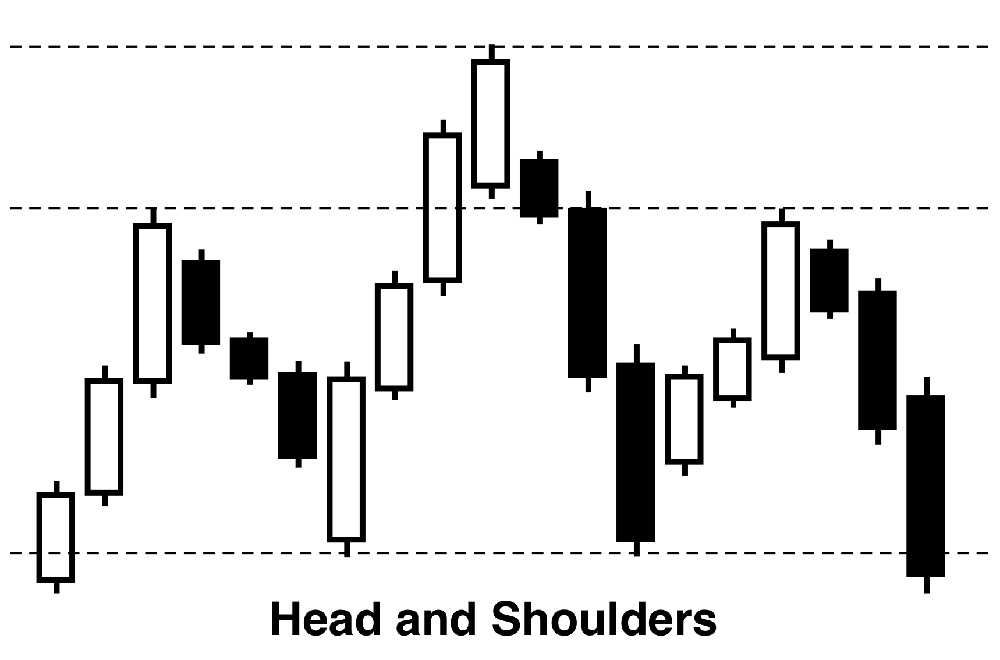{#fig:head_and_shoulders width=35%}

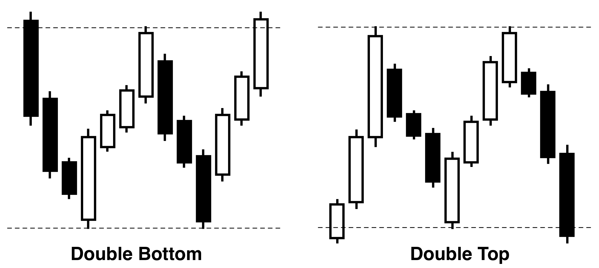{#fig:double_patterns}

With the rise of advanced machine learning techniques, the discovery and categorization of Novel or 'Generic Patterns' have become more refined [@Tsinaslanidis_Guijarro_2021]. These patterns, although newer, have garnered attention due to their recurring appearances. It is worth noting that while some sources ascribe trading successes to these patterns, the limited empirical evidence from a few studies makes such claims demand careful consideration. Among the various machine learning methods employed, clustering serves as just one example of how these patterns have been systematically categorized and identified.

Subsequent literature has highlighted potential challenges in trading strategies [@Lento_Gradojevic_2011]. Issues, such as neglecting transaction costs and the risk of overfitting, have been emphasized. These considerations stress the need for careful and precise strategy development. In this context, the Triple-Barrier Method stands out in algorithmic trading [@Prado_2018]. Rather than solely relying on price returns for labeling, this method integrates three key criteria: profit objectives, stop-loss levels, and a predefined time window. This multi-faceted approach to labeling makes it less dependent on raw price movements and offers a more nuanced perspective on potential trade outcomes. By doing so, it aims to provide a more robust foundation for algorithmic models, enhancing adaptability in various market conditions.

Building on the explored literature, this study aims to thoroughly examine the effectiveness of these patterns. While chart patterns are often emphasized, there's a clear lack of detailed research on the topic. It is important to point out that, based on current academic views, patterns should be interpreted with caution. However, given the widespread enthusiasm for patterns in online trading communities, this research seeks to determine if such caution is truly warranted and to add to the current knowledge of technical analysis.

# Prerequisite Work

In order to contextualize the methodologies and findings presented in this research, this section provides an overview of the primary data sources, the criteria for their selection, and the preliminary infrastructure development. By establishing this foundation, we aim to facilitate a comprehensive understanding of the subsequent research methodologies and results.

**Data Collection and Preparation:**

Initially, we sourced data from Binance [@binance] for cryptocurrencies. However, due to cryptocurrency's pronounced volatility and its limited historical depth, we chose not to pursue this further. The focus shifted to stock market data, specifically from Unicorn's EOD Historical Data [@eod_api], which offered daily candles spanning several decades. In the effort to acquire a comprehensive dataset for pattern detection, we curated about 500 symbols from a pool of 10,000 US-traded symbols, applying criteria such as market capitalization and historical length. The literature review indicated that many studies were limited in scope, prompting the broader approach. The dataset, which includes the top 250 companies each quarter from 1986 to 2022, became the foundational data for the research. However, it is imperative to note the potential survivorship bias [@Kan_Kirikos_Halpern_Andrew], and any optimistic outcomes should be interpreted with this consideration.

**Infrastructure Development:**

While generalized platforms like Spark [@spark] offer extensive capabilities and flexibility, they sometimes fall short in delivering highly optimized performance for specific tasks. The decision to devise a custom pipeline for stock data processing arose from a desire for end-to-end control, allowing for hyper-optimization tailored to the unique requirements, particularly with the foundational emphasis on candle data and the derivative data computations it necessitates. Though traditional tools can be powerful, they might not provide the level of granular optimization that a custom-built solution can. Hence, the research leaned on a pipeline that did not just offer agility and insightful analysis, but also unparalleled control, enabling optimization and parallelization at every stage.

This pipeline leveraged a microservices architecture [@Salah_Jamal], each catering to a unique aspect of stock data (Figure \ref{fig:platform_topology}):

1. **Bridge Service**: Integrates external stock data into the internal system.
2. **Candle Processor**: Handles candlestick data visualizing price movements.
3. **Indicator Processor**: Generates key market indicators from raw stock data.
4. **Event Processor**: Automates and oversees algorithmic stock analysis.

Recognizing the static nature of historical stock data, caching was integrated at each computation stage, optimizing performance. Data was segmented into blocks, inspired by the HTTP protocol's chunked data requests, ensuring efficient storage and retrieval. HTTP was the chosen communication protocol for its simplicity, though it demanded meticulous management due to its high request rate.

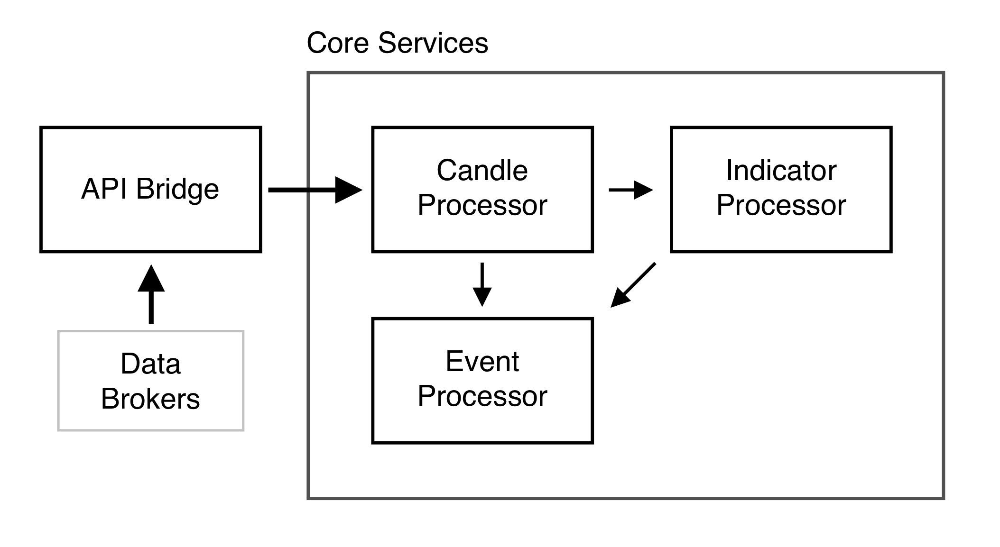{#fig:platform_topology}

**Visualization Development:**

A custom visualization tool was crafted to tackle challenges in analyzing stock market data. This tool aimed for speed, flexibility, and reduced programming overhead. While open-source solutions like matplotlib offer a broad spectrum of functionalities, they sometimes are not optimized for in-depth time series analysis. Additionally, commercial and specialized tools often kept essential features behind paywalls or were challenging to master. Given these constraints, we chose to develop a tool using the React framework [@react], ensuring fast data handling and rendering. It should be emphasized that the intention was not to eclipse established platforms [@tradingview_charts] but rather to create a specialized solution tailored for precise visualization of financial time-series data (Figure \ref{fig:vis_tool_patterns}).

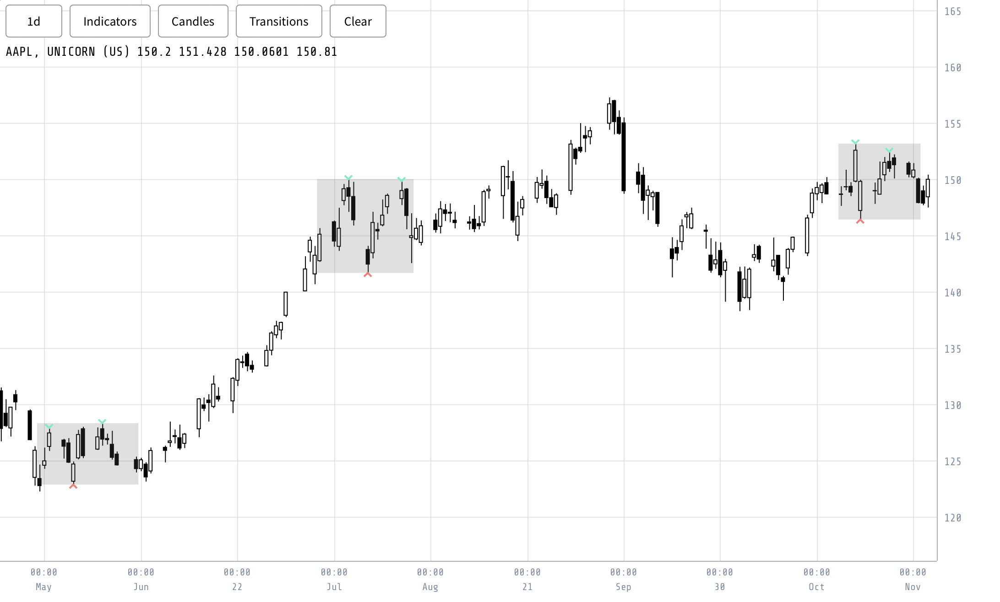{#fig:vis_tool_patterns}

# Approach

**Detecting Patterns:**

The journey into pattern detection started with a machine learning-driven clustering technique. We believed that frequently occurring market patterns would stand out when clustered, especially in contrast to random or sporadic market movements. With this idea, we attempted to utilize Dynamic Time Warping (DTW) [@Tsinaslanidis_Guijarro_2021].

However, this approach was more intricate than we initially thought. Rather than isolating distinct recurring patterns, we encountered numerous high-frequency patterns. Many of these seemed to echo random market changes instead of clear trends. These issues, combined with the computational challenges of clustering, led us to rethink the strategy.

We shifted to a script-based detection method, focusing on established patterns often discussed in financial studies. We specifically emphasized the double bottom and double top patterns, choosing them for their regular appearance in market data and their straightforward descriptions.

The script-based approach came with its own set of challenges, primarily due to noisy data and unexpected anomalies. Yet, with the structured engineering of the pipeline, implementation was more straightforward. We were able to reliably identify patterns such as the double bottom, double top, triple bottom, triple top, and head and shoulders in the market data. Subsequent steps involved evaluating these patterns based on their occurrence and performance.

**Evaluating Performance:**

In determining the impact of specific events on price trajectories, we employed two methodologies: the Triple Barrier Method and the Hybrid Bucket-based Classifier.

The Triple Barrier Method (Figure \ref{fig:example_triple_barrier}) incorporates three barriers – two horizontal and one vertical – categorizing outcomes based on the first barrier breached. It accentuates:
- Directionality in price movement.
- Capture of sudden market downturns.
- Independence from mere price values.

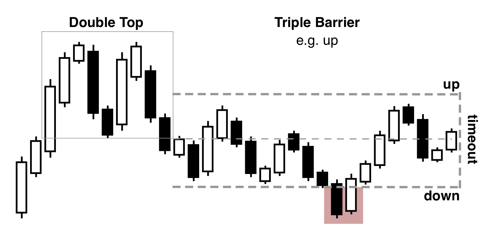{#fig:example_triple_barrier}

However, the method's vertical barrier might omit some price dynamics. Addressing this, we devised the Hybrid Bucket-based Classifier (Figure \ref{fig:example_buckets}). This method divides outcomes into distinct ranges, capturing all dynamics, including those potentially overlooked by the Triple Barrier Method.

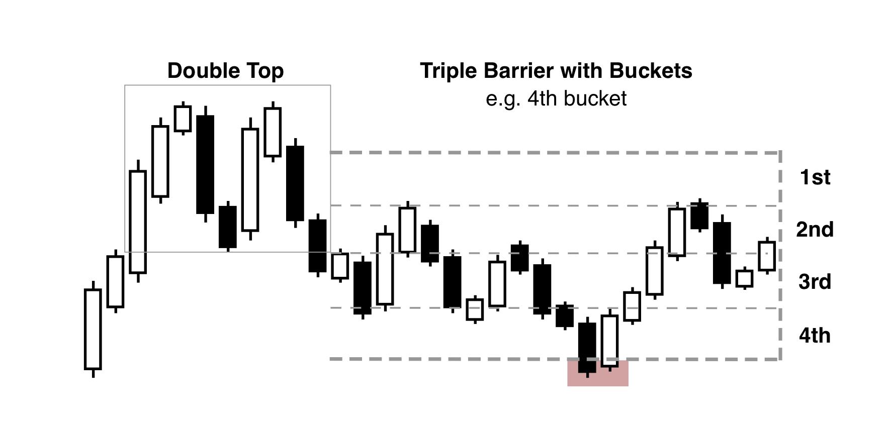{#fig:example_buckets}

While the hybrid offers granular insights, for the purposes, the Triple Barrier Method's directionality and comprehensive view make it the primary evaluation technique, effectively discerning event-driven price movements.

**Statistical Testing:**

The primary objective is to validate that the observed patterns transcend random events and hold genuine predictive power. To achieve this, we used the following evaluation measures:

- **Success Rates**: We analyzed distinct patterns like double bottom, double top, among others, calculating their success using:
  $$ \text{Success Rate} = \frac{\text{Successful occurrences}}{\text{Total occurrences}} $$
  Comparisons were drawn against both main and random data to evaluate pattern reliability versus random instances.

- **Proportions Z-Test**: The z-test assessed the predictive capability of the patterns against random events. A notable z-score indicates patterns outperforming randomness, with p-values quantifying the confidence in these results.

- **Bonferroni Correction**: Given the multiple pattern evaluations, p-values were adjusted using the Bonferroni correction, ensuring the conclusions remain robust against potential Type I errors from multiple comparisons.

- **Effect Size**: Beyond mere significance, the real-world impact of observed differences was gauged using Cohen’s $h$, offering a comprehensive view of the practical implications of the findings.

Through this multi-faceted statistical approach, we aimed to robustly ascertain and quantify the validity and impact of the identified patterns in trading scenarios.

# Results

This section distills the findings from the examination of various trading pattern algorithms.

**Random Pattern:** Random (Figure \ref{fig:barrier_random}) exhibited an increase in win rate in conjunction with the barrier's thresholds. This trend can be attributed to the stocks sourced from the S&P500 index, which historically has a rising trajectory. The statistical analysis confirmed that this increasing win rate can be explained by the inherent upward nature of the S&P500 index itself.

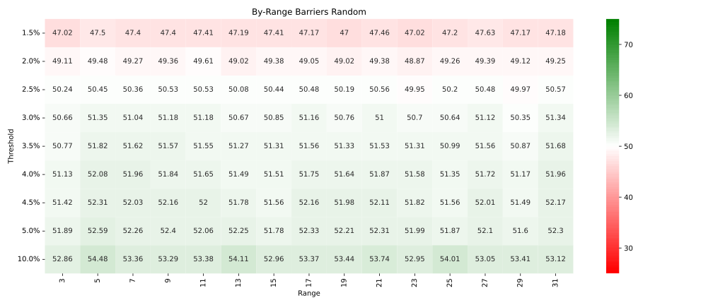{#fig:barrier_random}

**Double Bottom Pattern:** The double bottom (Figure \ref{fig:barrier_double_bottom}) consistently yielded a higher win rate than break-even, outperforming the random baseline. Although the difference was statistically significant after applying the Bonferroni correction, the practical effect size was small, with on average a Cohen's $h < 0.03$.

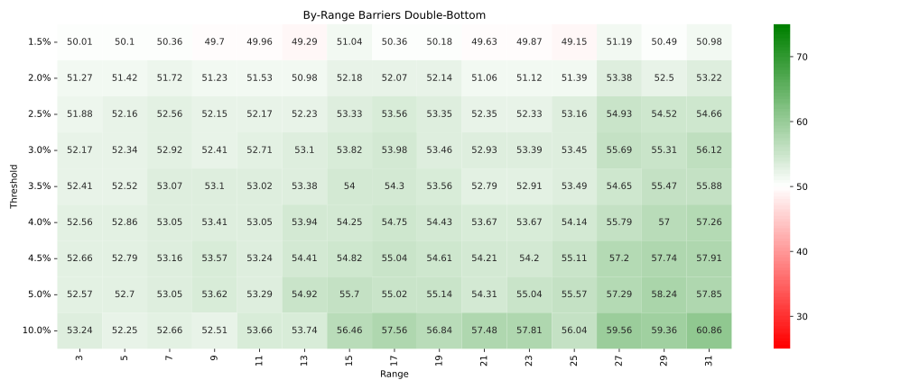{#fig:barrier_double_bottom}

**Double Top Pattern:** The double top (Figure \ref{fig:barrier_double_top}) pattern exhibited win rates often exceeding 50%, which was not what we expected, as we expected a trend reversal instead of a continuation. Its performance was statistically significant after the Bonferroni correction, but only up to a 4% threshold, indicating its effectiveness might diminish at higher thresholds. The practical effect size was small, with on average a Cohen's $h < 0.02$.

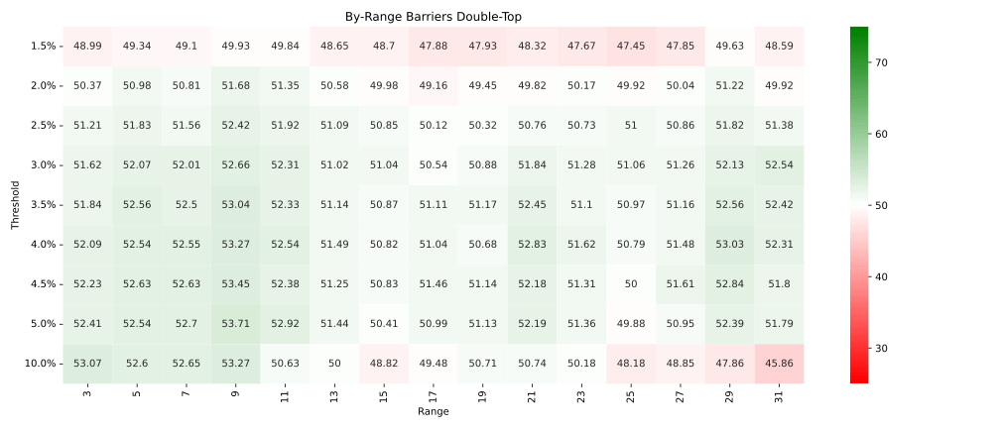{#fig:barrier_double_top}

**Others (Triple Bottom, Triple Top, Head and Shoulders):** The results did not find these patterns to provide consistent or statistically significant advantages after correcting for multiple comparisons. This might suggest their performance diverges from theoretical expectations when applied to real-world trading data.

{#fig:barrier_triple_bottom}

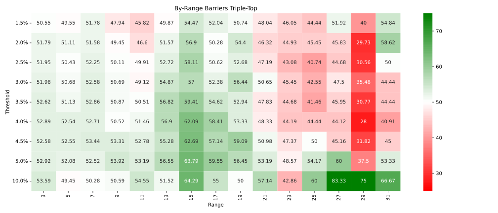{#fig:barrier_triple_top}

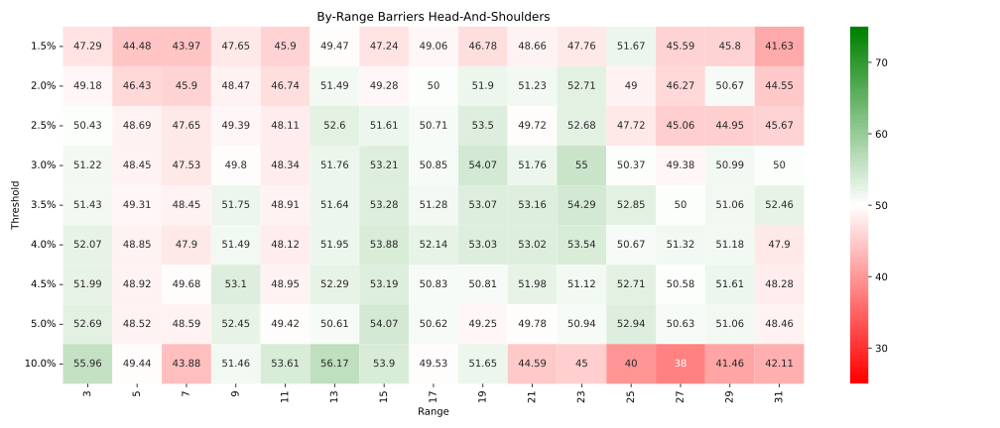{#fig:barrier_head_and_shoulders}

**Temporal Analysis:** An year-over-year analysis revealed subtle trends in pattern performance. For instance, the double bottom pattern demonstrated a slight but consistent decline in its win rate over the years (Figure \ref{fig:yoy_double_bottom}), albeit not reaching statistical significance. The double top and other patterns, when analyzed year-over-year, similarly exhibited trends that did not achieve statistical significance.

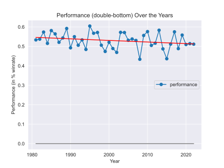{#fig:yoy_double_bottom}

# Conclusion

This study sought to gauge the efficacy of widely recognized financial market patterns. Initially leaning towards machine learning techniques, practical complexities led us to a scripted, algorithmic approach. Central to the work was an extensive software pipeline, facilitating the efficient analysis of stock datasets and a custom visualization tool, addressing challenges of data interaction.

Key findings include:

1. Classical patterns' effectiveness is questionable. For instance, the head and shoulders pattern appears no different from random occurrences, and other patterns, like the double bottom, offer minimal effect sizes.
2. Patterns' performance remains largely consistent over time, despite the tech evolution and trading shifts. This constancy suggests a potential inherent limitation in their foundational efficacy.

In conclusion, while trading patterns have shown some utility, their consistent performance amidst technological advances raises doubts about their foundational effectiveness. Furthermore, literature suggests that relying solely on these patterns might be limiting. Combining them with other parameters, such as trends, could enhance their predictive accuracy. Exploring these combinations and diving deeper into machine learning offer promising avenues for future research.

# References

\vspace{0.5cm}