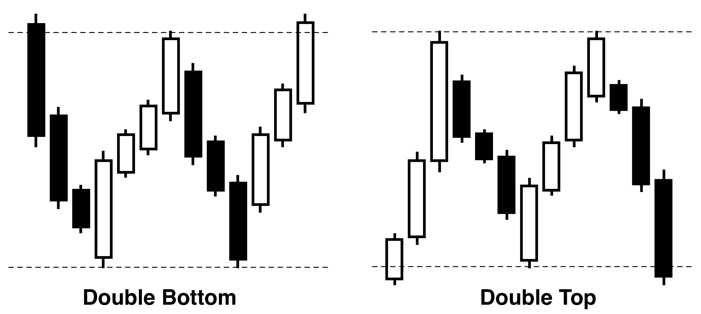
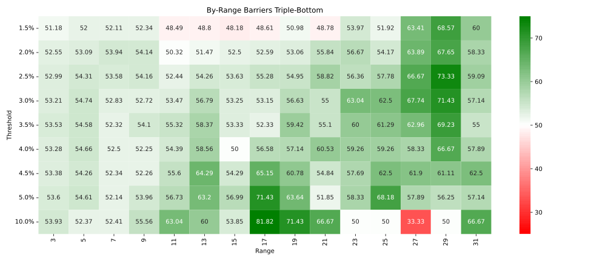
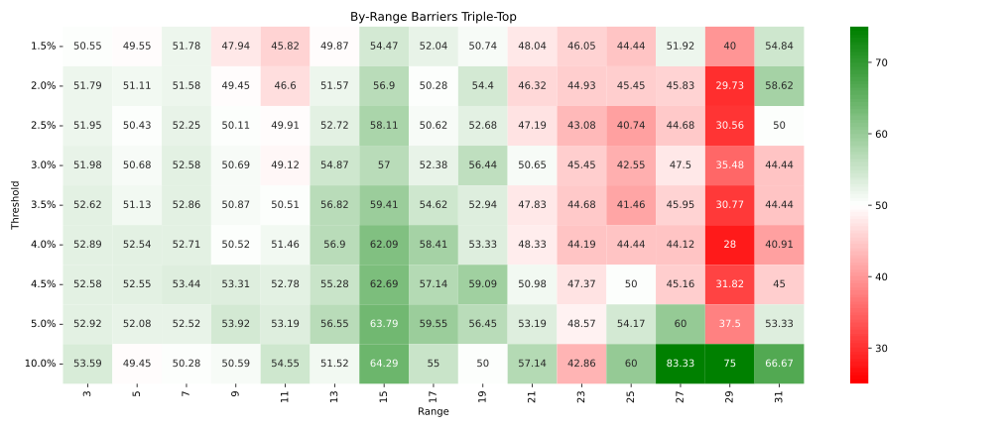

---
classoption:
  - twocolumn
  - fontsize: 11pt
numbersections: true
---

\title{Charting Wall Street: Detecting Common Trading Patterns and Assessing Their Relevance in Today's Automated Landscape}
\author{Rudolf \textsc{Aelbrecht}}
\date{\today}
\pagenumbering{gobble}

\maketitle

\begin{abstract}
Technische analyse, een fundamenteel onderdeel van handelsstrategieën, heeft met de opkomst van particuliere handelaren toenemende belangstelling gewonnen. Het herkennen van handelspatronen, evenals hun efficiëntie en betrouwbaarheid, blijven centrale onderwerpen van discussie. In deze thesis hebben we een uitgebreide dataset samengesteld door honderden symbolen te extraheren van bedrijven die genoteerd staan op de historische S\&P 500-index. Dit met als doel de voorspellende kracht van bekende handelspatronen te onderzoeken. Door gebruik te maken van een specifiek ontworpen proces voor het verwerken van beursgegevens, verkennen we twee verschillende methoden voor patroondetectie: clustering en script-gebaseerde benaderingen. De effectiviteit van deze patronen wordt beoordeeld met behulp van label-gebaseerde prestatie-indicatoren. Vervolgens wordt hun voorspellende nauwkeurigheid vergeleken met die van willekeurige momenten. Deze vergelijkende analyse verschaft inzicht in de historische context van handelspatronen en hun toepasbaarheid.
\end{abstract}

# Introductie

Sinds de oprichting van de aandelenmarkt hebben handelaren getracht marktbewegingen te voorspellen, vooral door middel van technische en fundamentele analyse. Technische analyse, die zijn fundament vindt in de studie van historische prijstrends, is gebaseerd op de overtuiging dat vroegere marktprestaties toekomstige bewegingen kunnen aangeven [@Murphy1998-ro]. Fundamentele analyse, daarentegen, focust zich op het beoordelen van de intrinsieke waarde van een bedrijf, zoals zijn financiële gezondheid en positie binnen de industrie.

Met de komst van online brokers wenden veel nieuwkomers, vaak minder geïnformeerd dan ervaren beleggers, zich tot de ogenschijnlijke eenvoud van technische analyse. Dit vooral gezien de toenemende interesse in handelspatronen. Deze patronen, versterkt door de beschikbaarheid van nieuwe activaklassen zoals cryptocurrencies en de opkomst van machine learning-algoritmes, worden beschouwd als effectieve instrumenten. Echter, twijfels over de daadwerkelijke effectiviteit van technische analyse blijven, met argumenten dat de betrouwbaarheid niet uitstijgt boven pure toeval [@Park_Irwin_2007].

Bestaande wetenschappelijke inzichten over technische analyse zijn verdeeld. Vele studies worden bekritiseerd vanwege mogelijke bias, beperkte datasetomvang of onduidelijke methodologie [@Silva_Sobreiro_Kimura_2017]. Met het doel bij te dragen aan dit debat, richt dit onderzoek zich op het evalueren van handelspatronen over meerdere decennia door gebruik te maken van geavanceerde machine learning-technieken. We onderzoeken: de effectiviteit van machine learning in het identificeren van handelspatronen, hun voorspellende kracht, en de verschuivende relevantie in een tijdperk waarin machine learning steeds dominanter wordt.

Dit onderzoek beoogt meer inzicht te geven in de bruikbaarheid van handelspatronen, aan te bevelen welke technieken het beste zijn voor patroonherkenning, en toekomstig onderzoek te stimuleren door tools te ontwikkelen voor een gestroomlijnde verwerking van beursgegevens. Dit alles ten dienste van zowel beginnende als ervaren handelaren.

In Sectie 2 verdiepen we ons in het domein van technische analyse en bieden we een overzicht van de huidige literatuur. Sectie 3 beschrijft de fundamentele stappen die we hebben ondernomen ter voorbereiding. Sectie 4 behandelt de benaderingen voor patroondetectie, waaronder zowel clustering-gebaseerde als script-gebaseerde methodologieën. In Sectie 5 bespreken we de resultaten en Sectie 6 sluit af met de conclusies.

# Technische Analyse

Binnen het domein van technische analyse hebben grafiekpatronen een blijvende prominentie behouden, wat hun aanhoudende fascinatie onder handelaren en enthousiastelingen benadrukt. Uit de omvangrijke handelsliteratuur en handleidingen van de afgelopen decennia zijn er twee hoofdcategorieën te onderscheiden. De eerste categorie betreft de Traditionele Patronen - vaak aangehaald in tal van niet-academische handelsboeken [@Bulkowski_2002,@Murphy_2009]. Deze worden herkend aan hun kenmerkende vormen, zoals het "head and shoulders"-patroon (Figuur \ref{fig:head_and_shoulders}) en het "double top/bottom"-patroon (Figuur \ref{fig:double_patterns}). De frequentie waarmee ze in populaire literatuur worden genoemd staat in schril contrast met het merkbare gebrek aan empirisch onderzoek naar hun winstgevendheid. Deze kloof tussen handelsliteratuur en wetenschappelijke validatie vormt de achtergrond voor deze thesis.

{#fig:head_and_shoulders width=35%}

{#fig:double_patterns}

Met de vooruitgang in machine learning-technieken is er een nieuwe categorie handelspatronen geïntroduceerd, bekend als 'Generic Patterns' [@Tsinaslanidis_Guijarro_2021]. In tegenstelling tot traditionele patronen in technische analyse, ontstaan deze Generic Patterns rechtstreeks uit het machine learning-proces. Hoewel bepaalde bronnen hun handelssuccessen toeschrijven aan deze nieuwe patronen, suggereert het beperkte empirische bewijs dat zulke beweringen een grondige evaluatie behoeven. Clustering, als een van de machine learning-methoden, illustreert hoe deze Generic Patterns systematisch worden geïdentificeerd en gecategoriseerd.

Er is in de literatuur tevens aandacht voor uitdagingen die kunnen opduiken bij handelsstrategieën [@Lento_Gradojevic_2011]. Zaken als het negeren van transactiekosten en het risico van overfitting zijn onder de aandacht gebracht. Deze aspecten benadrukken het belang van een zorgvuldige strategieontwikkeling. Een benadering die hier opvalt is de Triple-Barrier Methode in algoritmisch handelen [@Prado_2018]. Deze gaat verder dan enkel prijsrendementen voor labeling en omvat drie criteria: winstdoelstellingen, stop-loss niveaus en een vooraf vastgestelde tijdsduur. Door deze aanpak krijgt men een genuanceerder beeld van mogelijke handelsresultaten, waardoor modellen beter gegrond zijn en flexibeler kunnen inspelen op verschillende marktsituaties.

Gezien de bestaande literatuur heeft deze studie als doel de effectiviteit van deze patronen diepgaand te verkennen. Hoewel grafiekpatronen vaak worden benadrukt, is er een opmerkelijk tekort aan gedetailleerde studies hierover. Op basis van huidige academische inzichten dient men voorzichtig te zijn met het interpreteren van patronen. Toch, gezien het grote enthousiasme in online handelsgemeenschappen, streeft dit onderzoek ernaar om te bepalen of dergelijke voorzichtigheid gerechtvaardigd is en zo een bijdrage te leveren aan de bestaande kennis over technische analyse.

# Voorbereidend Werk

Deze sectie biedt een raamwerk om de methodologieën en resultaten van dit onderzoek te begrijpen. Het geeft een overzicht van de belangrijkste gegevensbronnen, de selectiecriteria en de ontwikkeling van de initiële infrastructuur. Door deze voorbereiding te schetsen, beogen we een helder inzicht te geven in de volgende onderzoeksmethodologieën en resultaten.

**Data Verzameling en Voorbereiding:**

Initieel werden gegevens van Binance [@binance] voor cryptocurrencies verzameld. Echter, gezien de opvallende volatiliteit en beperkte historische diepte van cryptocurrencies, besloten we onze focus te verleggen naar de aandelenmarkt. Hierbij vertrouwden we op gegevens van Unicorn's EOD Historical Data [@eod_api], die dagelijkse candles leverden over meerdere decennia. Bij het samenstellen van een uitgebreide dataset gericht op patroondetectie selecteerden we zorgvuldig ongeveer 500 symbolen uit een totaal van 10.000 in de VS verhandelde symbolen, met criteria zoals marktkapitalisatie en historische duur als leidraad. Ondanks dat eerdere studies vaak beperkt waren qua scope, kozen wij voor een uitgebreidere benadering. Onze dataset, die de top 250 bedrijven per kwartaal tussen 1986 en 2022 bevatte, diende als basis voor dit onderzoek. Het is echter essentieel om bewust te zijn van een mogelijke overlevingsbias [@Kan_Kirikos_Halpern_Andrew], en optimistische resultaten dienen in dit licht te worden bekeken.

**Infrastructuurontwikkeling:**

Ondanks dat algemene platforms zoals Spark [@spark] breed inzetbaar en flexibel zijn, kunnen ze soms niet voldoen aan specifieke prestatiebehoeften. De keuze voor het ontwikkelen van een aangepaste pijplijn voor de verwerking van beursgegevens kwam voort uit de wens voor controle, wat resulteerde in een hyper-geoptimaliseerde aanpak, specifiek voor candlegegevens en daaruit afgeleide berekeningen. Onze aanpak berustte daarom op een pijplijn die niet enkel flexibiliteit en inzicht bood, maar ook controle, waarmee optimalisatie en parallelle verwerking op elk niveau werden gerealiseerd.

We hanteerden een microservices-architectuur [@Salah_Jamal], waarbij elke service specifiek was gericht op een bepaald facet van beursgegevens (Figuur \ref{fig:platform_topology}):

1. **Bridge Service**: Integreert externe beursgegevens in het interne systeem.
2. **Candle Processor**: Verwerkt candlegegevens en visualiseert prijsbewegingen.
3. **Indicator Processor**: Genereert cruciale marktindicatoren vanuit de ruwe beursgegevens.
4. **Event Processor**: Stuurt en overziet geautomatiseerde algoritmische beursanalyses.

Omdat historische beursgegevens onveranderlijk zijn, werd caching toegepast op elk verwerkingsniveau om de prestaties te optimaliseren. We verdeelden gegevens in blokken, geïnspireerd door de 'chunked' data-aanvragen van het HTTP-protocol, om zo efficiënte opslag en snelle toegang te waarborgen. We kozen voor HTTP als communicatieprotocol vanwege de eenvoud, hoewel dit een uitgebreide cache strategie vereiste gezien de hoge request frequentie.

{#fig:platform_topology}

**Visualisaties:**

Voor de specifieke uitdagingen van beursgegevensanalyse is een op maat gemaakte visualisatietool ontworpen. We richtten ons hierbij op snelheid, flexibiliteit en het minimaliseren van programmeeroverhead. Ondanks dat opensource-oplossingen zoals matplotlib een breed spectrum aan functies aanbieden, zijn deze niet altijd geoptimaliseerd voor gedetailleerde tijdsreeksanalyses. Daarnaast merkten we op dat commerciële en gespecialiseerde tools vaak waardevolle functies vergrendelden achter betalingsmechanismen of een steile leercurve hadden. Mede door deze uitdagingen besloten we een eigen tool te ontwikkelen met het React-framework [@react]. Dit framework stond garant voor vlotte gegevensverwerking en -weergave. Het is essentieel om te benadrukken dat ons doel niet was om gevestigde platforms zoals TradingView[@tradingview_charts] te overtreffen, maar om een tool te creëren die specifiek was afgestemd op de nauwkeurige weergave van financiële tijdsreeksgegevens, zoals geïllustreerd in Figuur \ref{fig:vis_tool_patterns}.

{#fig:vis_tool_patterns}

# Aanpak

**Detectie van Patronen:**

Onze zoektocht naar het detecteren van marktpatronen startte met een clusteringsmethode gebaseerd op machine learning. We gingen ervan uit dat marktpatronen die frequent voorkwamen, duidelijk zichtbaar zouden zijn wanneer ze in clusters werden gebracht, vooral in contrast met sporadische of willekeurige marktbewegingen. Geïnspireerd door deze hypothese, pasten we Dynamic Time Warping (DTW) [@Tsinaslanidis_Guijarro_2021] toe.

Deze benadering bleek echter gecompliceerder dan we aanvankelijk hadden geanticipeerd. In plaats van specifieke, terugkerende patronen te identificeren, ontdekten we een overvloed aan hoogfrequente patronen. Veel van deze patronen reflecteerden willekeurige marktbewegingen eerder dan concrete trends. Door deze bevindingen en de computationele uitdagingen die met clustering gepaard gaan, besloten we onze strategie te herzien.

Als alternatief kozen we voor een script-gebaseerde detectiemethode, waarbij de focus lag op bekende patronen zoals beschreven in financiële literatuur. Specifiek hebben we ons gericht op de 'double bottom' en 'double top' patronen, vanwege hun frequente verschijning en hun relatief eenvoudige beschrijvende aard.

Deze script-gebaseerde aanpak kende weliswaar ook zijn uitdagingen, vooral door ruis in de gegevens en onvoorziene anomalieën. Desondanks bleek de implementatie, gezien de goed gestructureerde opzet van onze pijplijn, vergelijkbaar eenvoudiger. Hiermee konden we betrouwbaar patronen identificeren zoals 'double bottom', 'double top', 'triple bottom', 'triple top' en 'head and shoulders'. Onze volgende stappen bestonden uit het beoordelen van de frequentie en prestaties van deze geïdentificeerde patronen.

**Prestatiebeoordeling:**

Voor het meten van de invloed van specifieke marktgebeurtenissen op prijsfluctuaties, hebben we twee evaluatiemethoden aangenomen: de Triple Barrier Methode en de Hybrid Bucket-gebaseerde Classifier.

**Triple Barrier Methode:**
Dit evaluatiemechanisme werkt met drie barrières - twee horizontale en één verticale. Afhankelijk van welke barrière het eerst wordt doorbroken, worden de uitkomsten geclassificeerd. Deze methode is nuttig omdat het:
- De richting van prijsbewegingen benadrukt.
- Plotselinge marktdalingen vangt.
- Niet enkel gebaseerd is op absolute prijswaarden.

{#fig:example_triple_barrier}

Een beperking van de Triple Barrier Methode is echter dat de verticale barrière soms bepaalde prijsdynamieken kan missen.

**Hybrid Bucket-gebaseerde Classifier:**
Om de bovengenoemde beperking aan te pakken, introduceerden we deze classifier. Deze benadering verdeelt de uitkomsten in verschillende bereiken en neemt alle prijsbewegingen in beschouwing, zelfs degenen die mogelijk niet worden gevangen door de Triple Barrier Methode.

{#fig:example_buckets}

Hoewel de Hybrid Bucket-gebaseerde Classifier een dieper inzicht geeft in prijsbewegingen, blijft de Triple Barrier Methode de voorkeursmethode vanwege zijn duidelijke richting en holistische blik. Het stelt ons in staat om prijsbewegingen die worden beïnvloed door specifieke gebeurtenissen, effectief te onderscheiden.

**Statistische Testen:**

Ons primaire doel was om aan te tonen dat de door ons geïdentificeerde patronen niet slechts willekeurige gebeurtenissen waren, maar daadwerkelijk beschikten over voorspellende waarde. We hebben verschillende technieken gebruikt om dit doel te bereiken:

- **Succesratio's**: Door het analyseren van diverse patronen zoals de double bottom, double top en anderen, hebben we hun succes gemeten met de volgende formule:
  $$ \text{Succesratio} = \frac{\text{Aantal succesvolle gebeurtenissen}}{\text{Totaal aantal gebeurtenissen}} $$
  Hierbij hebben we onze bevindingen vergeleken met zowel echte als willekeurig gegenereerde data om de effectiviteit van de patronen ten opzichte van willekeurige scenario's te beoordelen.

- **Z-test van Verhoudingen**: Door de z-test toe te passen, hebben we de voorspellende kracht van de patronen tegenover willekeurige gebeurtenissen geëvalueerd. Een significante z-score duidt erop dat de patronen significant beter presteren dan willekeurige scenario's, en de bijbehorende p-waarden geven de betrouwbaarheid van deze uitkomsten weer.

- **Bonferroni-correctie**: Aangezien we meerdere patronen hebben geëvalueerd, gebruikten we de Bonferroni-correctie om p-waarden aan te passen. Dit zorgt ervoor dat onze bevindingen beschermd zijn tegen het risico op Type I-fouten die kunnen ontstaan door meerdere vergelijkingen.

- **Effectgrootte**: Naast het vaststellen van statistische significantie, hebben we ook de praktische relevantie van de waargenomen verschillen gemeten met Cohen's $h$. Dit biedt een dieper inzicht in de daadwerkelijke impact van onze bevindingen.

Door deze uitgebreide statistische methoden te combineren, streefden we ernaar de validiteit en het potentiële effect van de waargenomen handelspatronen op een grondige en kwantitatieve manier vast te stellen.

# Resultaten

De onderstaande resultaten geven een overzicht van onze bevindingen met betrekking tot de prestaties van diverse handelspatronen.

**Willekeurig Patroon:** Het onderzochte willekeurige patroon (Figuur \ref{fig:barrier_random}) toonde een groeiend winstpercentage in verband met de barrièredrempels. Dit kan worden verklaard door de algemene opwaartse trend van de S&P500-index gedurende de onderzoeksperiode.

{#fig:barrier_random}

**Double Bottom Patroon:** Dit patroon (Figuur \ref{fig:barrier_double_bottom}) vertoonde consistent positieve resultaten ten opzichte van het break-even niveau, overtreffend het willekeurige patroon. Desondanks was de praktische impact ervan relatief beperkt, met een bescheiden effectgrootte volgens Cohen's $h < 0.03$.

{#fig:barrier_double_bottom}

**Double Top Patroon:** Tegen onze verwachtingen in toonde dit patroon (Figuur \ref{fig:barrier_double_top}) regelmatig een winstpercentage dat de 50% overtrof. Hoewel significant tot een drempel van 4%, wijst dit op een mogelijke afname van de effectiviteit bij hogere drempelwaarden.

{#fig:barrier_double_top}

**Andere Patronen:** Triple bottom, triple top, en head and shoulders leverden geen consistent of significant voordeel op na aanpassing voor meervoudige toetsing. Dit suggereert dat de praktische prestaties van deze patronen kunnen afwijken van hun theoretische verwachtingen.

{#fig:barrier_triple_bottom}

{#fig:barrier_triple_top}

{#fig:barrier_head_and_shoulders}

**Temporele Analyse:** Een jaarlijkse analyse toonde aan dat bepaalde patronen, zoals het double bottom patroon, in de loop der tijd een lichte afname in winstpercentages vertoonden (Figuur \ref{fig:yoy_double_bottom}), hoewel deze trend niet als significant werd beschouwd.

{#fig:yoy_double_bottom}

# Conclusie

Onze studie richtte zich op de validatie van gangbare financiële marktpatronen. Hoewel we oorspronkelijk naar machine learning-technieken keken, bracht de praktische uitvoerbaarheid ons naar een scriptgebaseerde algoritmische benadering. De kern van dit onderzoek was een geavanceerde softwarepijplijn die grondige analyses van aandelen datasets mogelijk maakte, gecomplementeerd door een visualisatietool voor intuïtieve gegevensinteractie.

Enkele kernpunten uit onze bevindingen zijn:

1. De effectiviteit van traditionele patronen is niet overtuigend. Bijvoorbeeld, het head and shoulders patroon lijkt gelijkwaardig aan willekeur, en andere patronen zoals double bottom hebben slechts een minimale impact.

2. Patronen behouden grotendeels hun prestatieniveau ondanks technologische vooruitgang en veranderende handelslandschappen. Dit suggereert dat er mogelijk een inherente limiet is aan hun effectiviteit.

Samenvattend suggereren onze bevindingen dat traditionele handelspatronen op zichzelf een minimale impact hebben. Hoewel ze enige waarde kunnen hebben, blijft hun doeltreffendheid beperkt als ze geïsoleerd worden gebruikt. Er zijn aanwijzingen dat het integreren van deze patronen met aanvullende indicatoren, zoals markttrends, hun voorspellende potentieel kan versterken. Het verder onderzoeken en een diepere duik in machine learning-technieken belooft boeiende perspectieven voor vervolgonderzoek.

# Bibliografie

\vspace{0.5cm}