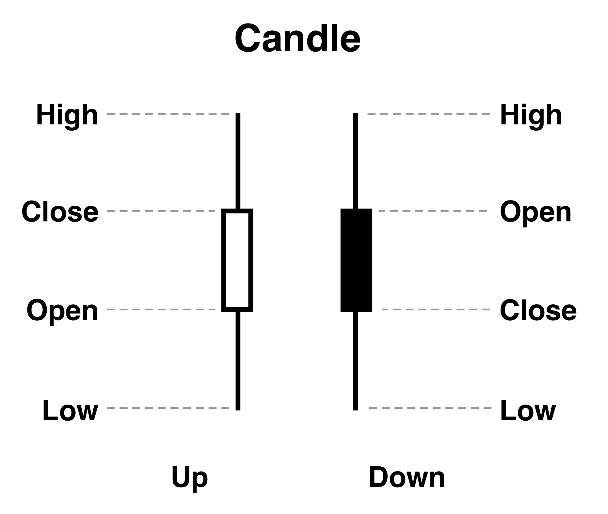
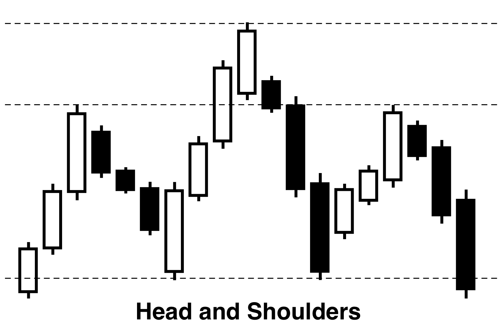

**Trading and investing**

Trading and investing often interchange in discussions about financial markets; however, they do not share the same meaning [@Teall_2023]. Trading typically involves the buying and selling of financial assets, like stocks, bonds, or commodities, with the aim of profiting from short-term price movements.

On the other hand, investing focuses on long-term strategies where an individual buys and holds an asset for an extended period. In long-term strategies, individuals hope to see assets appreciate over time, reducing the risk associated with short-term fluctuations by spending time in the market rather than timing the market. The focus is on profit through a gradual increase in the asset's value rather than short-term price fluctuations.

Different individuals use both strategies in different financial markets. More often, traders analyze patterns and movements in assets to decide whether to buy or sell. Meanwhile, investors concentrate on the fundamentals of an asset, including its financial health, earnings, revenue growth, and dividend yield, among other factors.

As we analyze trading patterns centered around market movements, we take the perspective of a trader.

**Stock market, stock exchanges, and market indices**

The stock market is a marketplace where individuals and institutions can buy or sell publicly traded companies. Companies sell shares to raise capital, and as the value of a company increases, so does the price of its stocks, resulting in a return for the buyer of the shares. The price of a share is determined by the last transaction price, often speculating more on a company's future performance than its present situation.

Stock exchanges are organizations that list and facilitate the buying and selling of stocks, providing a marketplace for buyers and sellers. Today, this marketplace is completely digital. Well-known stock exchanges include the NASDAQ, NYSE, and Euronext. However, for this thesis, we focus on stocks from the NYSE.

Market indices represent a specific category of stocks, often measuring performance. These indices commonly group stocks in a certain sector or based on shared traits, like the market value of a company. The most well-known market indices include the S&P500, featuring the 500 largest stocks in the United States, and the DJIA, which contains 30 large publicly traded companies. These lists are curated and not exact representations of the largest US companies, but they provide a good benchmark for the stock market's performance. Often, beating one of these indices is considered challenging, and thus they provide a reliable benchmark to compare an investor's portfolio performance.

**Stock splits**

A stock split is a corporate action where a company increases the number of its outstanding shares by dividing each existing share. For instance, in a 2-for-1 stock split, each share of the company's stock is divided into two. This action effectively doubles the number of shares while simultaneously halving the price of each share. Importantly, a stock split does not change the company's total market value, as the increase in shares is offset by the decrease in price.

Stock splits are often carried out by companies with a high share price to make their shares more affordable and attractive to retail investors. For instance, if a company's shares are trading at $200, a 2-for-1 stock split would reduce the share price to $100. Post-split, investors can buy twice as many shares for the same total investment.

**Technical analysis and quantitative analysis**

Technical analysis involves the use of charts, volume movements, and other tools to anticipate future price movements [@Murphy1998-ro]. It assumes market behavior repeats in the form of trends or patterns. Technical analysis frequently bases itself on indicators derived from market price or volume or patterns plotted on the candle chart.

Quantitative analysis employs mathematical and statistical models to analyze financial data [@Mitchell_1925]. It differs from technical analysis as it fully relies on algorithms to identify relationships and patterns in data. These algorithms can often be complex and reveal patterns that are not easily observable through traditional analysis.

Both technical and quantitative analysis complement each other but can also be used independently or combined to propose different trading strategies. However, due to the advanced mathematical and computational skills required for quantitative analysis, it is less popular among retail traders.

**Support and resistance**

Support and resistance are concepts that identify potential price levels in the market where significant buying or selling pressure might exist [@Osler_2006]. When the price rises but gets stuck at a certain level, this level is termed a resistance level. When the price falls but does not go below a point due to buying pressure, this level is known as a support level (Figure \ref{fig:support_resistance}).

{#fig:support_resistance width=90%}

Using technical analysis, it is possible to speculate about these levels in advance, allowing a trader to buy in zones just above the buying pressure, optimizing the price at which they enter the market.

**Candlesticks**

Candlestick charts often serve to show the historical price movements of assets. They display the open, high, low, and close price for a given time interval, represented as a candle. By using candles, more information can be presented without the need to plot multiple series.

{#fig:candle_description width=35%}

Candlesticks are depicted with a wick, representing the range between the lower and upper prices, and a body that indicates the opening and closing prices (Figure \ref{fig:candle_description}). While the choice of colors for the candles can vary, they are commonly represented as green (or white) and red (or black). In this context, a white candlestick indicates a closing price above its opening price, akin to a green candle. Conversely, a black candlestick signifies a closing price below its opening, similar to the traditional red candle.

In this thesis, candlestick charts are presented using a black and white color scheme. This choice is made for several reasons: to ensure aesthetic consistency across all figures, and importantly, to avoid the emotional connotations tied to colors like red and green. Red, often associated with losses or downturns, and green, linked with gains or positive movement, can introduce biases in interpretation. By using a neutral black and white scheme, we circumvent these associations, emphasizing that patterns can manifest in either direction and that a downward movement does not inherently signify a loss. Within this framework, a white candlestick indicates a closing price above its opening, whereas a black candlestick signifies a closing price below its opening.

**Trading patterns**

1. **Candle Formations**: Within the framework of trading wisdom, specific candlestick formations are often suggested to represent indicators of short-term trader sentiment. These patterns can emerge from a single candle or a short sequence of consecutive candles. For example, formations such as the Bullish Engulfing, Hammer, Three White Soldiers, and Morning Doji Star are frequently discussed as indicative of certain market behaviors. The Hammer is commonly viewed as a sign of a potential bullish turn, while the Morning Doji Star might indicate growing positivity during a downtrend, hinting at a possible upward move. It's crucial to note that such interpretations greatly rely on the surrounding context of previous price movements (Figure \ref{fig:simple_candle_patterns}).

2. **Series of Candles (Technical Analysis Patterns)**: Patterns over a series of candles are common in trading literature. Often relying on trendlines, support, or resistance levels to define their shape, these patterns provide insights into potential future price directions.

    - **Double Bottom/Top**: This pattern bounces twice from a support (for Double Bottom) or resistance (for Double Top) line, signaling a potential reversal (Figure \ref{fig:double_patterns}). The double bottom indicates a bullish reversal following a downtrend, whereas the double top suggests a bearish reversal after an uptrend. Variants include the triple bottom/top.

    - **Head and Shoulders**: Indicating potential reversals, this pattern consists of three peaks: a higher peak (head) flanked by two lower peaks (shoulders) (Figure \ref{fig:head_and_shoulders}). The key is a return to the baseline after each peak, signaling a reversal from the prevailing trend.

    - **Others**: Other notable examples of patterns in trading literature include Trendlines, which connect price highs or lows to indicate support or resistance levels; Wedges, which hint at narrowing price movements and potential reversals; and Flags, short-lived patterns that suggest continuation after a significant price move and consolidation.

3. **Generic Patterns from Machine Learning**: Beyond traditional technical analysis, machine learning provides tools to identify and predict price movements based on patterns that might not be evident to the human eye. By feeding historical price and trading volume data into algorithms, machine learning can discern recurring patterns and make predictions. Unlike traditional patterns which have established names and definitions, machine learning might identify 'generic' patterns based purely on mathematical relationships in the data. These patterns do not have set names or narratives but can be crucial for predictive analytics, especially when dealing with large and complex datasets.

{#fig:simple_candle_patterns width=50%}

{#fig:head_and_shoulders width=35%}

{#fig:double_patterns width=50%}

**Technical indicators**

Technical indicators are mathematical calculations based on an asset's price and, at times, its volume. They are used in technical analysis to provide insights into future price movements. Depending on the type of technical indicator, it can be plotted on top of the candle chart or presented as a separate chart.

A common example of a technical indicator is moving averages, which represent the average price calculated over a specific amount of time. These can be used to identify trend changes or potential support and resistance levels in the market. One particular type of moving average, known as the Simple Moving Average (SMA), is calculated based on a set number of recent candles.

{#fig:indicator_sma width=90%}

The Exponential Moving Average (EMA) is a type of moving average [@Zhu_Zhou_2009] that gives more weight to recent price data (Figure \ref{fig:indicator_ema}), which makes it respond more significantly to price changes than a simple moving average. It is often used to gauge short-term trends, providing traders with a quicker signal for buy and sell opportunities.

{#fig:indicator_ema width=90%}

Another technical indicator is the Relative Strength Index (RSI), which measures the speed and change of price movements and is often used to identify overbought or oversold conditions in a market [@Welles_Wilder_1978]. An RSI value above 70 suggests a potential overbought condition (indicating a potential price drop), whereas an RSI below 30 indicates a potential oversold condition (suggesting a potential price increase).

{#fig:indicator_rsi width=90%}

Bollinger Bands (BB) is another notable technical indicator, which is based on moving averages and standard deviations. It consists of an upper band, lower band, and a middle band (usually the simple moving average) [@Bollinger_2002]. The bands expand and contract based on market volatility and can be used to identify potential reversal points or overbought/oversold conditions. Since BB relies on other indicators like moving averages, it provides a layered analytical approach, reflecting both trend and volatility information.

{#fig:indicator_bb width=90%}