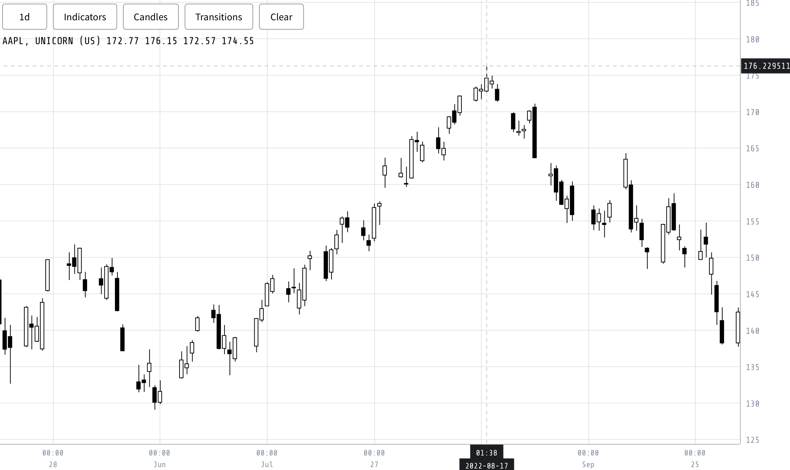

In this section, we present the development process of a custom visualization tool tailored to address the challenges associated with efficiently analyzing candle data, indicators, and patterns in the stock market. The primary objective behind this endeavor was to create a tool that offers improved speed and flexibility while minimizing the programming effort required.

While tools like matplotlib are versatile and widely-used, they were not specifically designed for extensive time series analysis, which can pose challenges when seeking a higher level of interactivity for effective visualization. Advanced platforms such as DXCharts [@dxcharts_charts] and TradingView [@tradingview_charts], although offering more specialized features, come with their own limitations. These tools, often part of larger web platforms, can be behind paywalls and necessitate considerable integration efforts, requiring users to familiarize themselves thoroughly with their APIs and mechanics. Additionally, intermediate solutions may present constraints, such as limiting the number of indicators or the volume of data that can be concurrently visualized, potentially inhibiting a comprehensive analysis of the diverse data patterns we've uncovered.

To overcome these limitations, we decided to develop the visualization tool specifically tailored to the research objectives (Figure \ref{fig:vis_tool_example}). The focus during the development process was on achieving efficient handling and rendering of large datasets. Through the strategic selection and implementation of algorithms and data structures, we ensured that the tool is capable of efficiently processing and visualizing the extensive amounts of data encountered in the stock market.

{#fig:vis_tool_example width=90%}

In the subsequent sections, the intricacies of the tool's development will be detailed. The aim was to strike a balance between simplicity and functionality, resulting in a tool that stands as a valuable resource for in-depth analysis of stock market data. This tool enables users to efficiently navigate various candle patterns, indicators, and associated trends. Recognizing the limited resources available for visualizing stock market data, the exploration seeks to provide a methodological approach for those in the research community. This can serve as a useful guide for individuals who are in search of a practical solution to visualize and comprehend financial data.