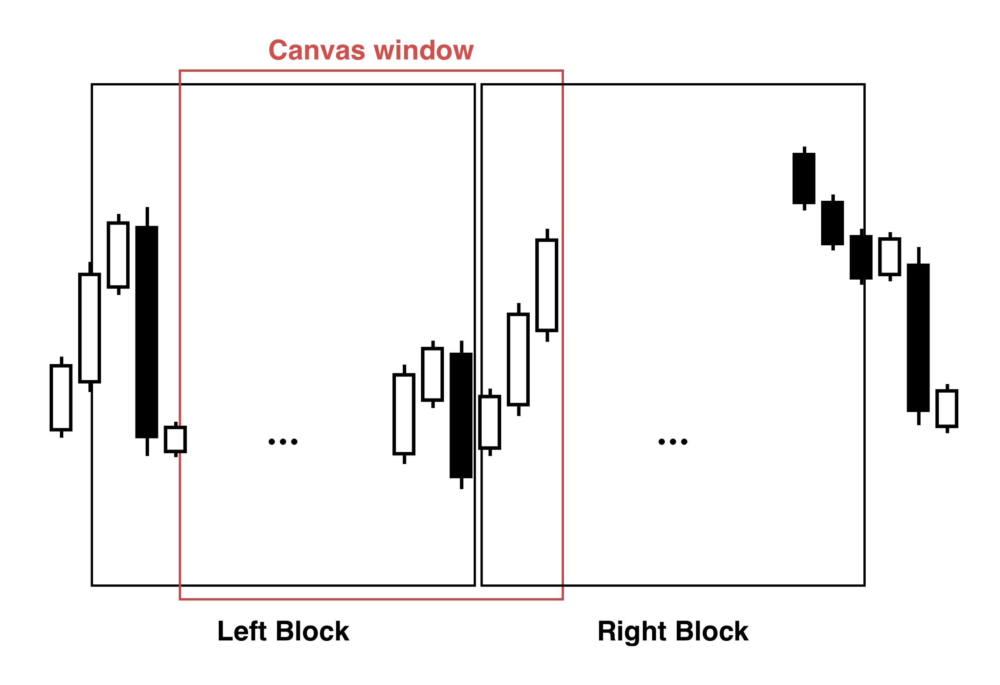
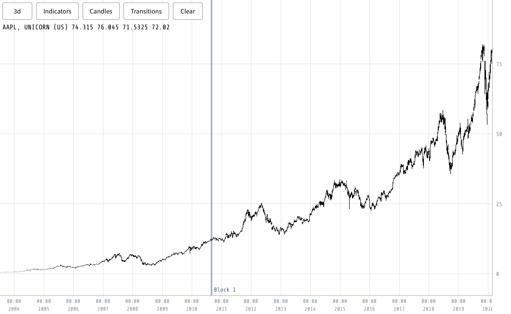

The charting process in the visualization tool commenced by prioritizing the retrieval and display of candle data. Upon the creation of the charting component, we implemented an event loop specifically designed to handle the data-fetching process. This event loop operated within the context of a React effect hook, granting us the flexibility to interrupt the process as needed. In the event that the chart component was destroyed, the event loop would be promptly canceled, ensuring that any pending fetch requests were discarded and preventing unnecessary resource consumption.

Within each iteration of the fetch loop, we identified the required data to be fetched. If any data was determined to be missing, we initiated the fetch process and stored the retrieved data in the model. Importantly, React remained unaware of these updates, thereby eliminating unnecessary updates to the Document Object Model (DOM). As a result, the canvas, which we had full control over, stood as the singular component within the application that relied upon this fetched data. The chart component is the sole component that relies on the fetched data, and its independent management of the data, separate from React's state management, does not hinder its functionality.

To efficiently manage the data for candle visualization, the system maintains two blocks of candles in memory at all times. Each block consists of 5,000 candles, ensuring that the displayed data never exceeds this limit. We allocate space in the model for these two candle blocks and record the corresponding start and end times. As users adjust the timeline, causing one block to move out of view and another to come into view, we seamlessly swap the data blocks and fetch the new block as required (Figure \ref{fig:candle_blocks_memory}). If only one block is visible, we retain it in the first slot of the model. An example of this boundary in blocks can be seen in Figure \ref{fig:vis_tool_block}.

{#fig:candle_blocks_memory width=50%}

{#fig:vis_tool_block width=90%}

To mitigate excessive server requests caused by rapid symbol switches or chart movements, we implemented a serialized update mechanism for charts. This mechanism ensures that we refrain from fetching another block while one is already being fetched, thereby preventing flooding of requests. Moreover, we introduced a delay mechanism to avoid overwhelming the server with repeated requests in case of temporary unavailability.

The same approach is applied to fetching indicators, incorporating the additional complexity of plotting multiple indicators on a single chart. To handle this, we utilize a map data structure to store the fetched blocks for each indicator. The map is organized based on a unique key generated by concatenating the indicator identifier and its parameters, ensuring a distinct identifier for each indicator. Although this approach may not be recommended in a production environment, we retain all values in the mapping without eviction. However, given that we store a maximum of two blocks per indicator combination, the memory usage remains insignificant for casual chart usage. When transitioning between assets, the indicator blocks are cleared, freeing up memory resources.