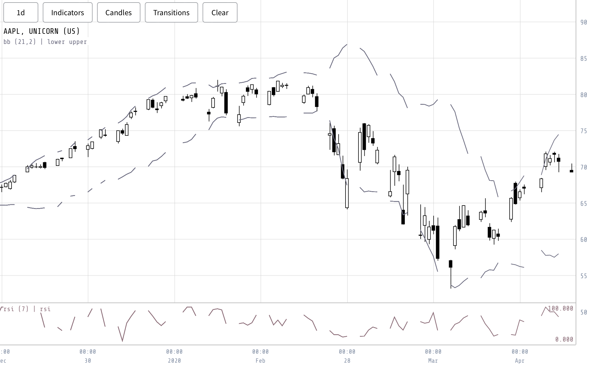

In addition to storing candle and indicator blocks in memory, the model also includes variables for the corresponding start and end times, as well as price bounds. These price bounds are calculated based on the candle data blocks currently stored in memory. If users choose to modify these bounds, they become decoupled from the candle blocks, allowing for independent adjustments.

With a buffer of two blocks that ensure the presence of all candles within the requested interval, we proceed to plot each candle within these blocks while excluding those that fall outside the bounds stored in the model. Determining the first and last visible candles is straightforward since the candle blocks are indexed as arrays. By converting the timestamps to corresponding indices within the blocks, we precisely locate the position of each candle on the chart.

The process of rendering each candle hinges on screen dimensions. The screen width helps define the width of each candle, affecting the portrayal of its body and wick. Additionally, the screen is segmented into slots, each representing a place for a visible candle. The conversion of time positions to slot indices ensures the accuracy of candle placements. The x-coordinate calculation translates time data to screen space. For the y-coordinate, we adapt the candle's price data to the screen's coordinate system, normalizing it to the range of visible prices and the screen height.

Utilizing the calculated x and y coordinates, we are able to determine the precise positions of all candle and indicator points on the chart. To facilitate smooth rendering, we leverage the requestAnimationFrame feature available in most browsers. By passing a function to this feature, the browser autonomously manages the animation loop, rendering frames as needed. This approach ensures that frames are only drawn when the window is visible and adheres to the device's frame rate.

When we no longer require the chart rendering, such as when we destroy the canvas, we can stop the rendering of frames by utilizing the cancel callback provided by the effect hook. This is similar to how we managed the fetching loop, ensuring efficient resource allocation and preventing unnecessary rendering when not needed.

Using the same process of plotting as candles, indicators are represented by a single data point that corresponds to a specific time and price. Therefore, the drawing of indicators follows an analogous procedure to that of candles. By applying the calculated x and y coordinates, we can accurately position indicator points on the chart, aligning them with their corresponding time and price values. In addition to price-based indicators, there are non-price indicators plotted at the bottom of the chart. These indicators represent independent values and are positioned using the same procedure based on specific time points. However, their y-values are normalized relative to the data within the corresponding indicator block.

With these advancements, we have successfully implemented a basic renderer capable of accurately rendering candles and indicators (Figure \ref{fig:vis_tool_indicators}). This renderer allows for the visualization of price movements and indicator trends, providing valuable insights into the analyzed data.

{#fig:vis_tool_indicators width=90%}