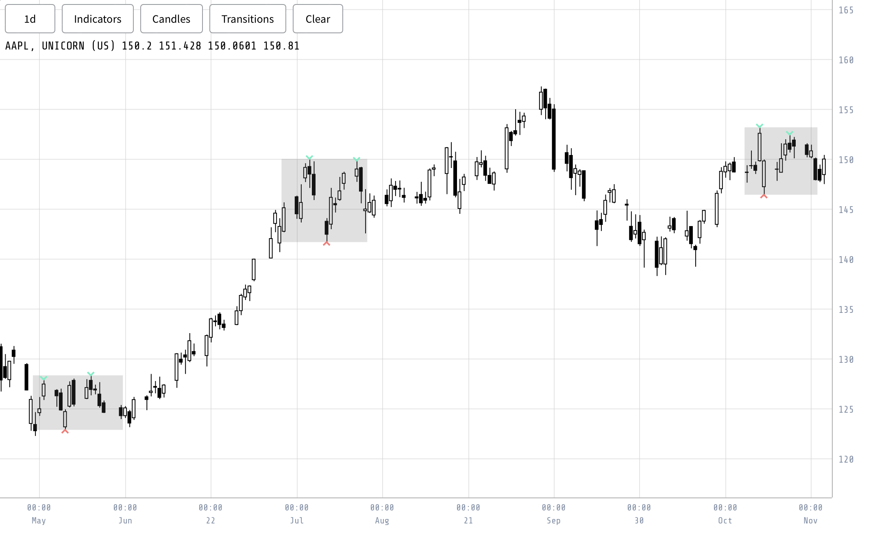

In the thesis, we delve into the detection of patterns represented by data containing price and time positions. These patterns are referred to as "events" and are plotted as visual elements such as lines, points, or text. Similar to retrieving candle data, we obtain these event structures and store them in the model of the chart. Instead of organizing them into blocks, we receive a sparse list of events, each containing information about shapes, lines, or labels based on price. Leveraging the understanding of handling candle data, we efficiently determine the screen positions for these event elements. Once the candles and indicators are plotted, we proceed to plot the event shapes onto the chart, showcasing patterns alongside the underlying data (see Figure \ref{fig:vis_tool_patterns}).

{#fig:vis_tool_patterns width=90%}