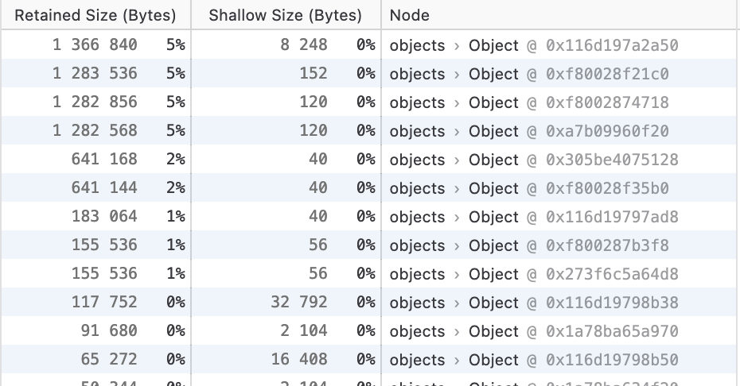

The utilization of the visualization tool provides a means to efficiently validate the output of the services. By visualizing the data, we can promptly identify any deviations from expected results and take appropriate actions. The tool's local execution allows us to stream a large volume of real-time candle data without being restricted by the limitations often imposed by online platforms, which may have restrictions on the number of items that can be plotted.

Regarding memory consumption, the tool demonstrates a low amount of resource usage. In Firefox, it only consumes 118MB of system memory when idle, with the two blocks of candles in memory accounting for a mere 1.2MB (Figure \ref{fig:firefox_memory_of_blocks}). Although the feature set is minimal compared to commercial tools like TradingView, the total memory consumption is significantly lower.

{#fig:firefox_memory_of_blocks width=60%}

It is important to emphasize that the tool is not intended to replace online platforms or other interactive applications. Instead, it serves as a valuable tool for visualizing results generated through algorithmic approaches. For tasks such as technical analysis (TA), we recommend utilizing online tools or dedicated interactive platforms that are specifically designed for user interaction. These platforms are better suited to meet user needs, offer more comprehensive features, and may include automation functionalities or proprietary code requirements.
