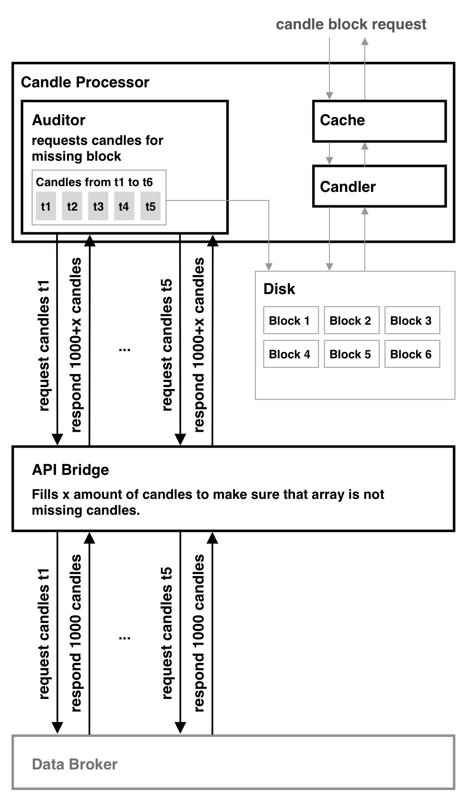

<!-- 2. Data Acquisition and Storage -->

When the service is initiated, an audit is performed to determine if any data requires updating. The audit process includes downloading any missing candle blocks. The duration of the initial startup time is minimal if the service was offline for a short period. In such cases, the missed blocks from the offline period to the restart are fetched. The feature of retrieving minute data for cryptocurrencies has been successfully implemented on Binance [@binance_api]. However, for research experiments focusing on stock data, the live updating feature for the stock market link has not been further developed. If the algorithm detection is employed in production, it becomes necessary to minimize API requests by continuously updating the candle data. This allows for realistic market pattern calculations to be performed every minute.

Even if real-time data is used, it is not relevant to the research objectives. Only daily candles are utilized, eliminating the need to keep the service online continuously.

Once the audit retrieves a candle from the bridge between the data brokers and the candle service, a collection of arbitrary candles is obtained. The only specification is that the candles should begin at a specific point in time. This starting point is chosen based on the size of the candle blocks. The collection of candles is then divided into candle blocks, and the subsequent data in the sequence is requested starting from the end of the last fully retrieved candle block. Some services allow retrieving all candles for the symbol's entire history in a single request, while others impose a limit of 1000 candles. Consequently, multiple requests are necessary to fill a single block. The auditor is responsible for requesting and filling blocks with candles received from the bridge. If the received candles are insufficient to fill a single block, the auditor needs to request multiple times based on the last received candles. In cases where enough candles are returned to fill multiple blocks, they need to be divided accordingly. Additionally, the auditor should account for rate limiting as described in the exchange information of each broker.

{#fig:platform_audit width=60%}

Each time a block is retrieved, it is stored on the disk. Once the audit is complete, the web server can read these files from the disk. This approach minimizes memory usage during retrieval and maintains a clear separation between the audit code and the server code. When a block is saved to disk, it is serialized using Go's gob package [@go_gob], which simplifies the reading and writing of Go structs. Gob is chosen for its speed and convenience in encoding and decoding data in Go.

A JSON meta file accompanies each binary file, providing basic information. During the audit, the meta files are parsed to determine which blocks have already been fetched and the data they contain. If a block has not been fully retrieved, it is deleted and requested again. This ensures that the service starts with the most up-to-date information.

The storage method for the files on disk is not a significant consideration. Since there is one file for every 5000 candles, even in the worst-case scenario, it poses no issues for the operating system or the auditor. It is even feasible to run the service with a remotely mounted share to store its data. By minimizing I/O operations through design, maintaining a large collection of stocks in this manner incurs only a slight overhead.

To maintain up-to-date data, the same audit code is executed every minute. This approach reduces the number of API requests needed to retrieve a full block. Only the last missing candles are requested, and active candle blocks are stored in memory until they are completed and then written to disk.