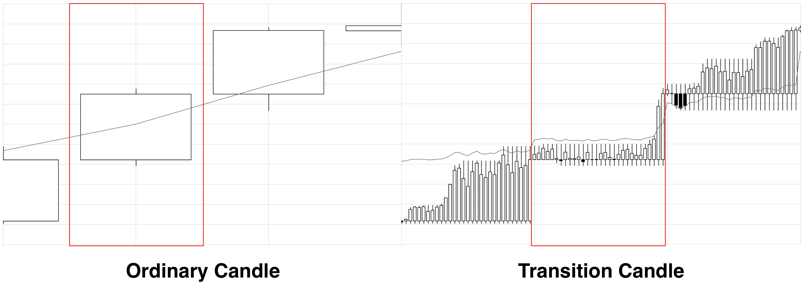
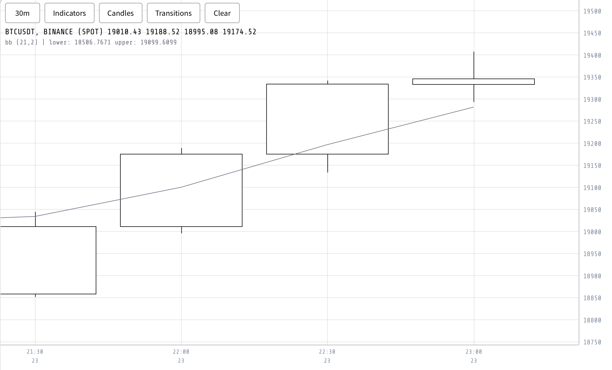
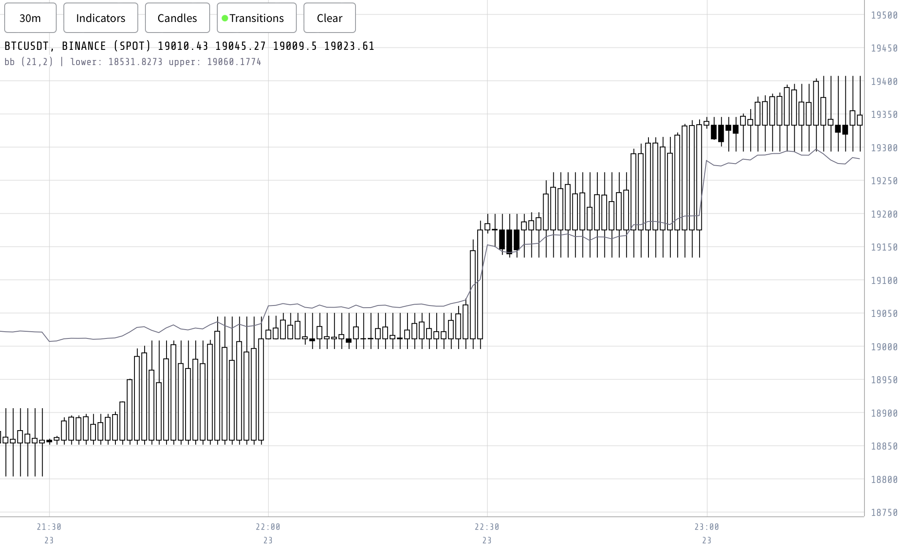
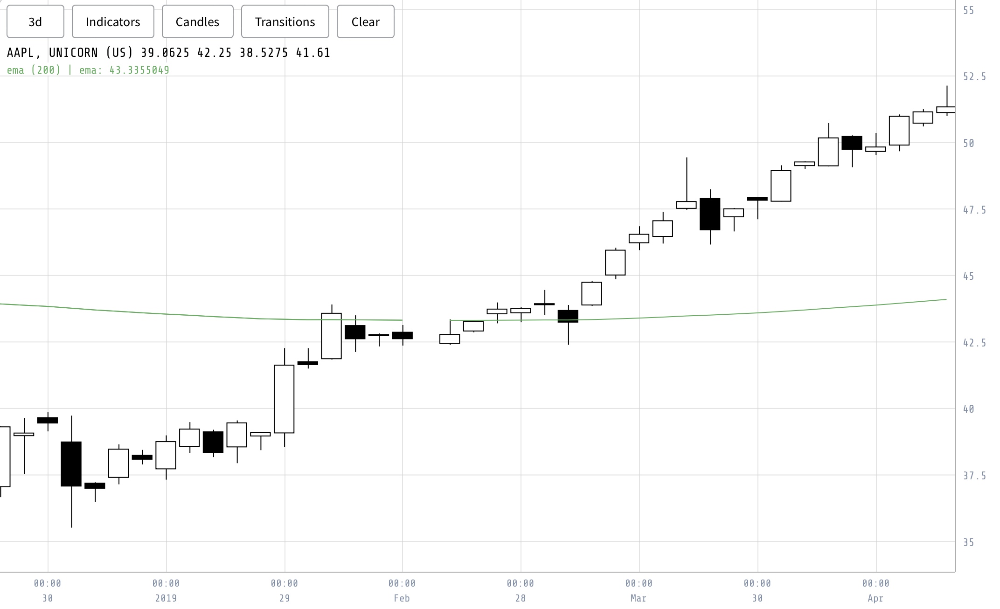
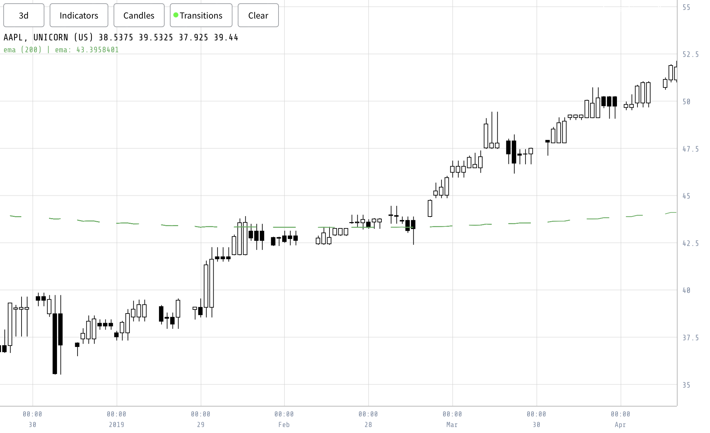

Evaluating a strategy or algorithm at extended time intervals can sometimes lead to skewed perceptions. This distortion might be more pronounced when viewing current charts. A potential misinterpretation arises due to indicators often representing only a singular point in time. In contrast, the inherent design of candles addresses this issue. Unlike indicators, candles visually encapsulate the entire movement range within their body and wicks. This design ensures a comprehensive overview of market movements, even when the candle is still in the process of forming.

To facilitate accurate calculations with an indicator, the concept of a transition block becomes crucial. Transition blocks are applicable to both candles and indicators. However, since indicators do not differentiate between block types and simply evaluate them based on the provided candles, the emphasis here is on explaining candle transition blocks.

In this context, evaluation involves processing the indicator as a transition indicator, incrementally, at each step throughout the simulation. Importantly, the resolution of the transition block aligns with the simulation's step size. If the simulation steps are minute-by-minute, for instance, the transition block is requested in minute resolution for the chosen interval, such as an hour.

This methodology guarantees an accurate representation of the indicator alongside its corresponding candle representation at each specific step, regardless of the broader timeframes used for the candles and indicators. By employing an indicator that evaluates the transition blocks, calculations retain their accuracy and representation within simulations, even when using larger intervals, like hourly ones, for candles and indicators.

As a result, it becomes a straightforward process to evaluate each step of the received transition block corresponding to each simulation step. This approach optimizes the process, making it highly efficient for any chosen step size in the simulation.

Transition candle blocks consist of candles associated with each timestamp of the resolution interval, which refers to the period on which the primitive candles are based. Another perspective is that transition blocks represent the values of the requested higher resolution interval (for example, 1 hour) by sampling values from a lower resolution (such as 1 minute). This method enables tracking of a candle's fluctuations over time (Figure \ref{fig:candle_vs_transition_candle}).

Figure \ref{fig:transition_binance_a} depicts the original chart with standard candles, while Figure \ref{fig:transition_binance_b} showcases a chart using transition candles. The transformation is notably visible when portraying an interval at high resolution. However, when selecting an interval based on a resolution with a smaller ratio (Figure \ref{fig:transition_unicorn_a}), the effect is less evident (Figure \ref{fig:transition_unicorn_b}).

The acquisition of these transition blocks involves progressing through the primitive candles that constitute the candles of the larger interval being requested. With each time step, the current candle merges with the previous one, and the result is stored. Upon completing the duration of a single candle at the requested interval, the transition candle resets to the candle in the subsequent step.

In most situations, the only requirement is the set of candles through which the process steps. However, a transition block might occasionally commence at an interval that begins midway through a candle of that interval. As a result, the preceding candle block is also retrieved, which allows for the initialization of the candle. Given that the mapping from candle block to transition block is 1:1, no further information will be required.

{#fig:candle_vs_transition_candle width=90%}

{#fig:transition_binance_a width=90%}

{#fig:transition_binance_b width=90%}

{#fig:transition_unicorn_a width=90%}

{#fig:transition_unicorn_b width=90%}

\clearpage

When services need an exact state of a candle at a specific time, they can request the transition candle block for that duration, as depicted in Algorithm \ref{algo:fetchTransition}. This gives the exact state of the candle at that moment. In simulations, this approach offers significant advantages: operations only utilize transition blocks, negating the need to account for changes in candles or indicators over time. Thus, any employed indicator or candle-set in the pipeline will be the transition block in use.

\begin{algorithm}[H]
    \caption{Fetch Transition Candles}
    \label{algo:fetchTransition}
    \begin{algorithmic}[1]
        \Procedure{FetchTransition}{$symbol, block, interval, resolution$}
            \If{$interval = resolution$}
                \State \Return \text{primitiveSet}($symbol, block, interval$)
            \EndIf

            \State $prevBlock \gets \text{GetPrimitiveSet}(symbol, block-1, resolution)$
            \State $currBlock \gets \text{GetPrimitiveSet}(symbol, block, resolution)$

            \State $blockStartTime \gets currBlock.UnixFirst()$
            \State $firstCandleTime \gets \frac{blockStartTime}{interval} \times interval$
            \State $stepIndex \gets \frac{blockStartTime}{interval}$
            \State $stepCandle \gets$ create new Candle with Time = $firstCandleTime$ and Missing = true

            \For{$i = prevBlock.Index(firstCandleTime)$ \textbf{to} $5000$}
                \State $c \gets prevBlock.AtIndex(i)$
                \State \Call{mergeCandles}{$c, stepCandle$}
                \State $stepCandle.Time \gets c.Time$
            \EndFor

            \State $candles \gets$ create empty array of size $5000$

            \For{$i = 0$ \textbf{to} length of $currBlock.Candles$}
                \State $c \gets currBlock.Candles[i]$
                \State $nextIndex \gets \frac{c.Time}{interval}$

                \If{$nextIndex \neq stepIndex$}
                    \State $stepIndex \gets nextIndex$
                    \State $stepCandle \gets$ create new Candle with Time = $c.Time$ and Missing = true
                \EndIf

                \State \Call{mergeCandles}{$c, stepCandle$}
                \State $stepCandle.Time \gets c.Time$
                \State $candles[i] \gets$ create copy of $stepCandle$
            \EndFor

            \State \Return $candles$
        \EndProcedure
    \end{algorithmic}
\end{algorithm}

Transition blocks may appear as a minor addition to the platform, but they proved crucial in debugging indicators. An added advantage is that they significantly simplify much of the simulation code used in later stages of the project.