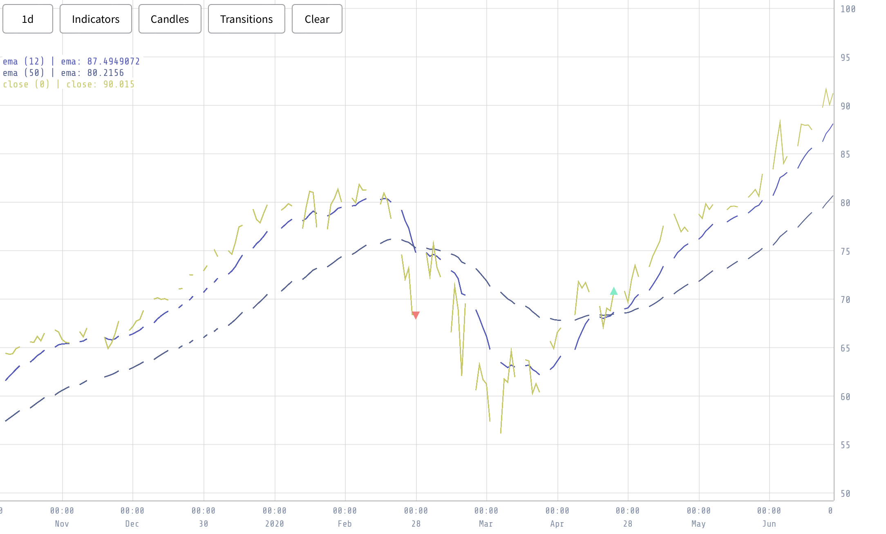

In the processing chapter, a processor was developed to generate events that will serve as features for the clustering algorithm. Event detection is performed using a dedicated script, which identifies specific events that are subsequently divided into windows. Each window represents a pattern, and the goal is to merge these patterns to identify common patterns. The main objective of the clustering algorithm is to identify common patterns within a set of random patterns.

To initiate the event generation process, a detector was created to identify fundamental events commonly used in trading. These events include ema-cross, bolling-band hits, and rsi lower and upper band hits. Each event can be detected by implementing a corresponding event detector that checks for specific conditions. For instance, in the case of ema-cross, the event detector would identify instances where a longer ema crosses a shorter ema, labeling it as an up-cross or down-cross depending on the context (Figure \ref{fig:ema_crosses}).

{#fig:ema_crosses width=90%}