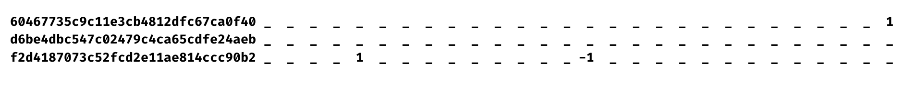

Despite initial efforts to identify patterns, challenges are encountered that hinder successful implementation. Contrary to initial expectations, a multitude of patterns with high occurrences are discovered rather than a limited set of common patterns. This observation prompts a reevaluation of the methodological approach, recognizing that the primary objective is to effectively identify and comprehend trading patterns.

Both the bottom-up and top-down clustering approaches pose difficulties in terms of computation time and memory usage, rendering clustering-based detection impractical for the specific aims. Notably, the extracted patterns lack discernible and interpretable structures, appearing more random in nature rather than indicative of meaningful market behaviors (see Figure \ref{fig:clustered_pattern} for an example of a pattern obtained through top-down clustering).

In light of these challenges, and to maintain focus on the central research question regarding the utility of trading patterns, a decision is made to explore alternative methods for pattern detection. The hope is that these alternative approaches provide greater clarity regarding the appearance and behavior of trading patterns in the market, potentially yielding valuable insights that may inform a future reconsideration of the clustering approach.

{#fig:clustered_pattern width=90%}

The underlying philosophy centers around enhancing pattern detection and visualization accessibility for retail traders. While the identified limitations could potentially be addressed by allocating additional resources to improve the performance of the clustering algorithm, such a solution would inadvertently restrict access to this innovative approach, as it would only be viable for individuals or organizations equipped with the necessary resources. The proposed alternative pattern detection method ensures broader accessibility by being compatible with standard computer systems, enabling real-time pattern detection without imposing significant resource requirements.