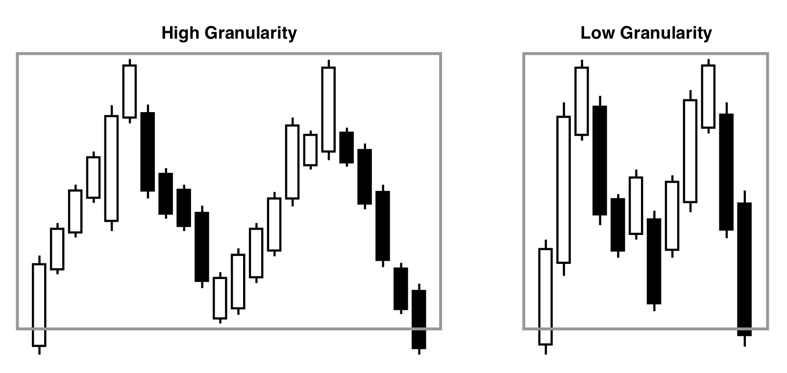

Before we embark on detecting patterns in the stock market, it is crucial to understand how patterns might appear from the perspective of different horizons. Traders that are using a large horizon will use large time intervals to base their decisions on, and vice-versa for traders with a small horizon, which will use smaller time intervals. Using smaller horizons often introduces more noise and volatile movements, which directly translates into more pattern occurrences. Detecting more patterns does not mean better, since signals are harder to interpret at smaller time intervals.

Detecting patterns using a clustering technique avoids this problem of temporality, with dynamic time warping making it possible to merge patterns that might have been warped in time. The clustering detector would produce results, regardless of the interval of the candles. One can think of DTW detecting patterns regardless of the granularity of the candles, where the granularity is how many candles of a specific interval (in the clustering examples, daily candles) contribute to a given pattern. A higher granularity would therefore mean that a pattern would consist of many candles (see Figure \ref{fig:granularity_pattern}).

{#fig:granularity_pattern width=60%}

When detecting patterns manually, we need to be able to detect patterns with any granularity. One way of achieving this is to run the pattern detector at different intervals (e.g., daily, 3 daily, weekly, biweekly, etc...). Another way is to use hyperparameters in the algorithms to detect patterns with more or less granularity. This way we can always use the same interval for the candles, but are still able to detect patterns with different granularity.

To summarize, just as we exclusively use daily candles in the clustering algorithms, we will also exclusively use daily candles in the manual pattern detection. This removes the need of evaluating multiple intervals. In order to still find candles in larger time frames, we will also introduce this concept of granularity to the manual pattern detector.

We explicitly state the interval of candles in the following sections. If there is nothing mentioned regarding the interval, it is the daily candle interval that is being used.