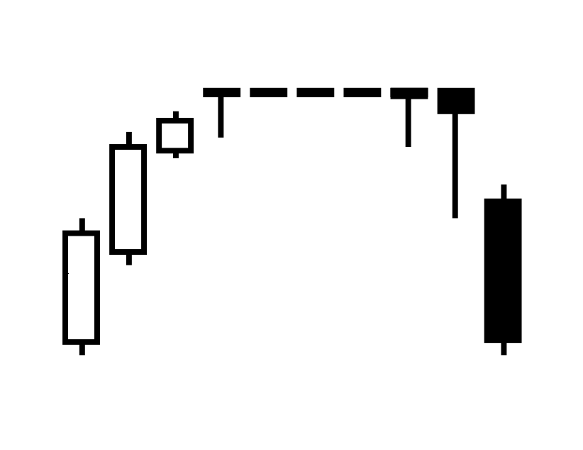

In order to detect all the common patterns, we need to identify the highs and lows. These points are considered resistance and support prices, prices at which buyers or sellers often place orders, and are the basis for lines that are commonly used in technical analysis.

Highs and lows are nothing more than local maxima and minima detection. We use a certain window size, and try to find the maxima and minima based on the price of candles. Since candles have 4 data points, we will use the lower price of the candle for the minima and the higher price for the maxima.

Say we have a window of seven, then checking if a given candle is a maxima is just as simple as looking if the three candles to its left and three candles to its right have high prices that are lower. The same logic applies to finding the minima. An example of this can be seen in Figure \ref{fig:high_and_low_pattern}.

{#fig:high_and_low_pattern width=65%}

To implement this algorithm, we make use of a first-in-first-out stack (FiFo). Each time the algorithm steps through one candle, we push the candle to the stack. If the stack is full, then the oldest candle will be removed. To find the high and low candles, we take the middle candle of the stack, which will be the candidate. If all other candles in the stack are lower, then we can mark the candidate as low. If all other candles in the stack are higher, then we mark the candidate as high.

Since we cannot look into the future, we cannot determine if the most recent candle will be the top. That means, depending on the range of the algorithm, the highs and lows will lag more as the range increases. Choosing a higher range, however, means that the highs and lows will be stronger indicators that could produce more reliable signals. We will evaluate the effect of range in the chapter discussing the results.

With the high and low events extracted, we can implement all the basic pattern detectors that we have planned to detect. Since these detectors only use these events as their input, the granularity of the patterns will depend fully on the range that is set for the highs and lows detection. For instance, if one uses a large range for detecting highs and lows, it will directly translate to patterns being detected over a larger timeframe, and thus have a higher granularity.

By sweeping the range of the high and low detector, we can detect all patterns in all temporal spaces. We therefore solve the concern of not being able to detect all the candles when we were limited to one interval. Since the pipeline is fast enough to generate these events in an instant, as long as ranges are within reasonable bounds, there should be no concern about performance.

A minimum value for the range would be 1, which would make every other candle a possible candidate for a high and low event. This, however, introduces a lot of noise candles, and we recommend using a minimum range of three to reduce the noise. The complexity of detecting a pattern will be $O(r*h)$, with range $r$ and history of an asset $h$, which means that the speed of calculating these events depends on the range.

There is no theoretical upper limit to the range, but the higher the range, the less relevant the events become due to their lagging nature. For example, if you would take a range of 100, then you would only know after 100 candles if you had reached the top, although it could have some use, the correlation will probably be insignificant. The largest range we used for testing was 40 days, we do not recommend any higher, as this produces very few usable events. We will visualize the number of events in relation to this parameter in the result chapter.

In the testing of this script, we noticed a lot of bad patterns marked as caused by ties in candle prices. When candles have the same highs or lows, as an effect of bad data quality (Figure \ref{fig:candle_ties_1}) or rare market circumstances (Figure \ref{fig:candle_ties_2}), they must be omitted from the result. Failing to omit these results could introduce a lot of worthless events that generate incorrect patterns in algorithms that use highs and lows as their basis.

{#fig:candle_ties_1 width=40%}

{#fig:candle_ties_2 width=30%}

We can simply ignore ties, by making sure that the high or low does not share a price with any other candle in its stack. This is sufficient for stock data. For currencies that use more precision, we would add a threshold, but since this is outside the scope of the thesis, we will not discuss it further.

Now that we have highs and lows, we should be able to detect most patterns that are based on horizontal resistance/support lines. These include: head and shoulders, inverse head and shoulders, double top, double bottom, triple top, and triple bottom.
