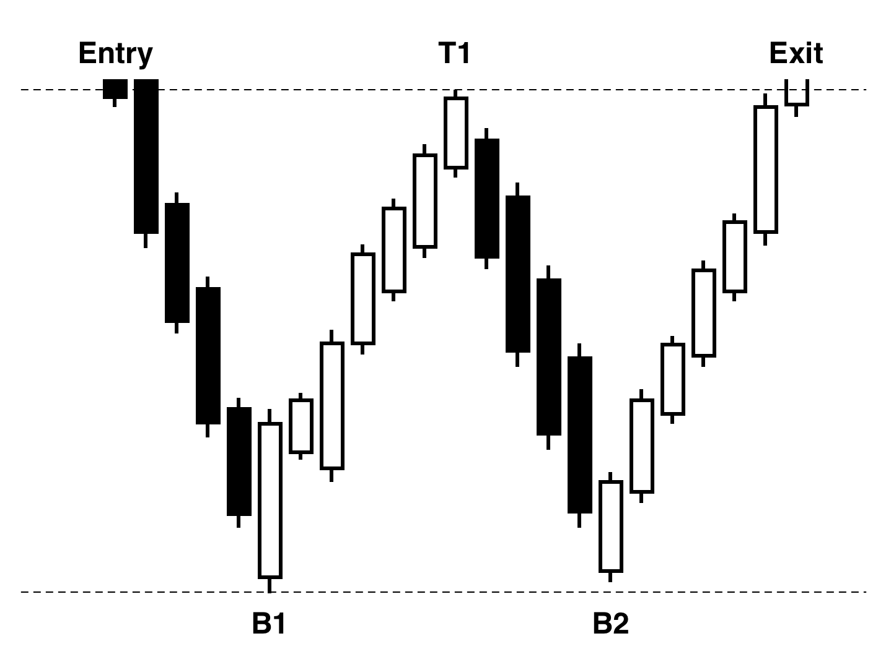
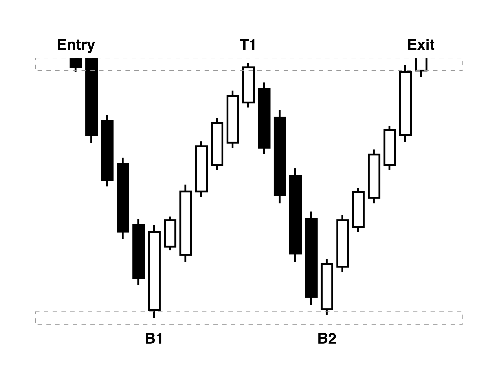
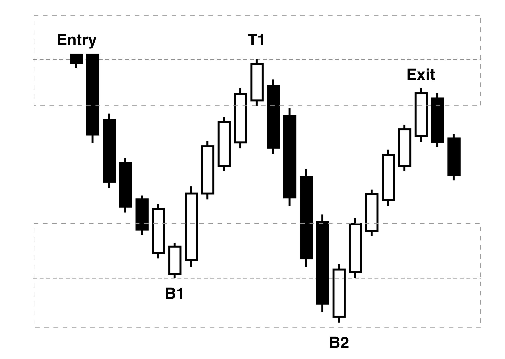
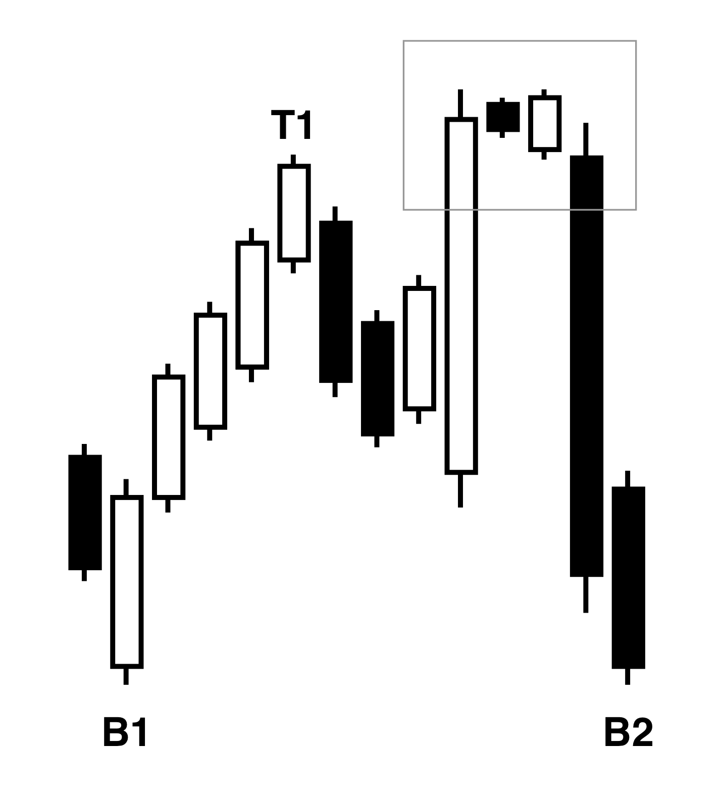
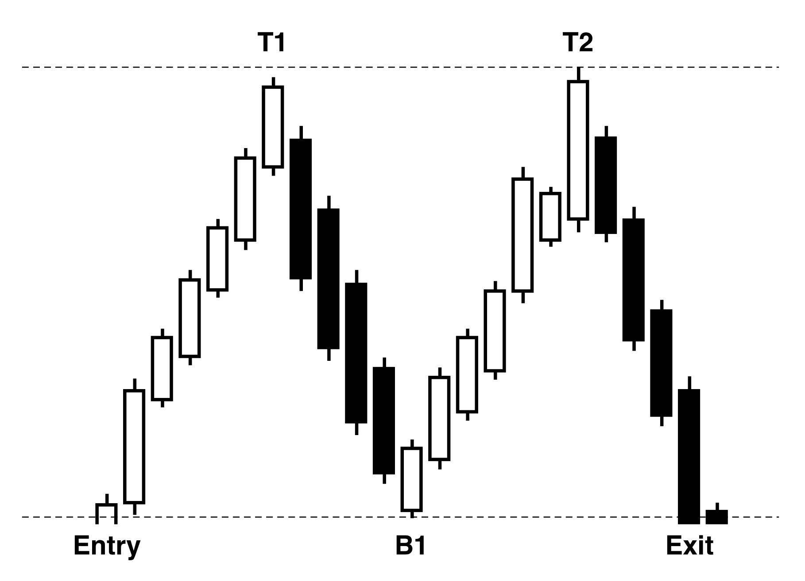
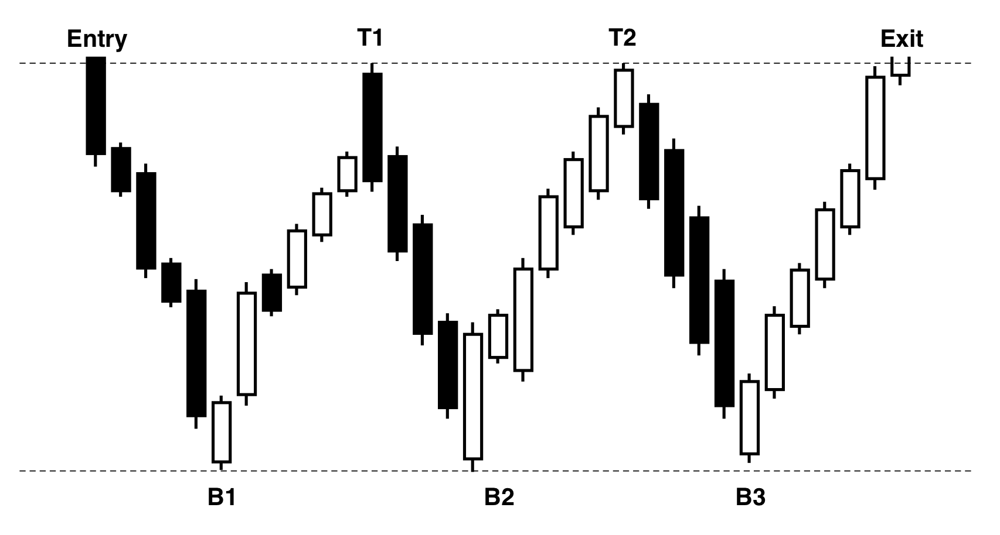
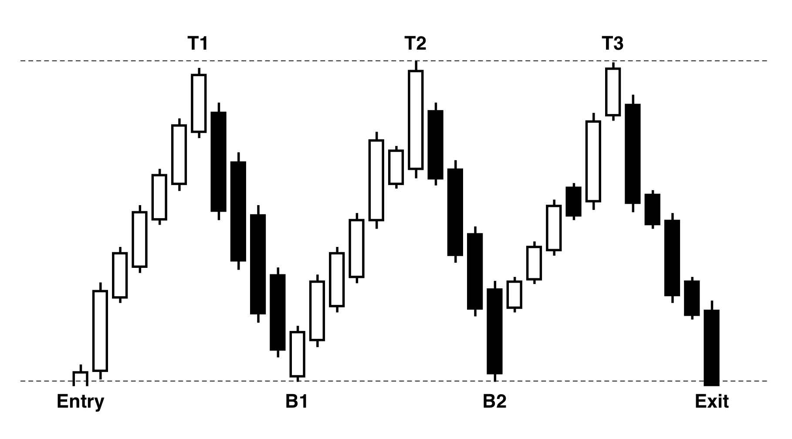
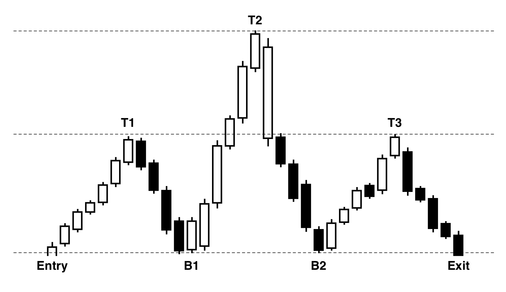

With the highs and lows, we can start detecting the most basic of trading patterns. We will be discussing double bottom, double top, triple bottom, triple top and heads-and-shoulders. These can be identified just by using high and low data points and the neighboring candles. All these trading patterns have very similar shapes, and can therefore be identified with almost the exact same algorithms. We will first discuss double bottom, and then explain the changes needed to detect any of the related patterns.

**Double Bottom**

Double bottom pattern is a common pattern used to identify a trend reversal (Figure \ref{fig:double_bottom_pattern}). It consists of two bottom points, one top, and entry and an exit. These make up a "W" shape. The bottom points form a support line, and the top forms a resistance line. At the support line, it is assumed that there are a lot of buyers, and hence the price will not go any lower. The same can be said for the resistance line. Once the resistance is broken, meaning that the price jumps above that level, the trend is predicted to continue upwards.

{#fig:double_bottom_pattern width=50%}

We will start by abbreviating a couple of words in the explanation:

 - $B1$: The first bottom of the pattern.
 - $B2$: The second bottom of the pattern.
 - $T1$: The first and only top of the pattern.
 - $Entry$: The first candle of the pattern, and the first candle touching the resistance line to the left of B1.
 - $Exit$: The last candle of the pattern, and the first candle touching the resistance line to the right of B2.

The double bottom pattern can thus be described as the following sequence: $Entry \rightarrow B1 \rightarrow T1 \rightarrow B2 \rightarrow Exit$, with no intermittent events. Since price data is noisy, and far from exact, we also introduce a $threshold$ parameter to allow some margin when determining the support and resistance line (Figure \ref{fig:good_pattern_threshold}). $threshold$ describes how much percent $B1$ can differ from $B2$, and how much $Entry$ and $Exit$ can differ from $T1$. We took a $threshold$ value of 1%, as making it much larger will start to produce wrong pattern results (Figure \ref{fig:bad_pattern_threshold}).

{#fig:good_pattern_threshold width=40%}

{#fig:bad_pattern_threshold width=40%}

We will first start by detecting the sequence $bottom$, $top$ and $bottom$. We allocate a small stack in the detector's memory. The size of this stack is 3 items, and it will contain the last 3 events that we parse from the highs and lows detector. If these events are the sequence that we are looking for, then we can start looking for $Entry$ and $Exit$.

Even if there is no high or low event, we will still attempt to find a new $Entry$ and $Exit$. $Entry$ can be known at any time if we have matched the top and bottom sequence, but $Exit$ might not be known if that candle is still in the future. The full detection script looks as follows:

1. Push any high and low event to the stack of 3 items
2. If the stack does not match $bottom \rightarrow top \rightarrow bottom$, we exit
3. If $B1$ and $B2$ differ more than $threshold$, we exit
4. Iterate all candles to the left of $B1$, if one is lower than $B1$ we exit, if one is higher than $T1 - threshold$ it is $Entry$
5. Iterate all candles to the right of $B2$, if one is lower than $B2$ we exit, if one is higher than $T2 - threshold$ it is $Exit$
6. Create an event with $Entry$, $B1$, $T1$, $B2$, $Exit$

If during the iterate step, we run out of candles, we exit. Missing candles are skipped at any time. Once we exit, the algorithm daemon will go to the next candle, and the process starts again from step 1.

When looking at the results, we identified some problems with patterns being recognized in areas with anomalies. This is an effect of the highs and low algorithm being conservative in detecting highs and lows. A missed high or low can cause us to match the wrong shape as a pattern (Figure \ref{fig:filter_pattern_tops}). We add an extra rule that whilst looking for the $Entry$ and $Exit$, we are not allowed to go higher than $T1-threshold$.

{#fig:filter_pattern_tops width=30%}

The pattern gets added to the output events at the moment that we have identified the exit. This means that the patterns can only be evaluated from the moment the timestamp of the exit candle.

**Double top**

Double-top pattern is the complement of the double bottom-pattern (Figure \ref{fig:double_top_pattern}). It consists of two tops, one bottom, and associated entry and exit points, forming an "M" shape. The tops act as resistance levels, while the bottom acts as a support level. The logic for this algorithm is exactly the same as for double bottom, and can be implemented, keeping in mind that lower, higher, top and bottom are to be switched around.

{#fig:double_top_pattern width=50%}

**Triple Bottom**

The triple bottom pattern is an extension of the double bottom pattern (Figure \ref{fig:triple_bottom_pattern}. It introduces an extra top $T2$ and bottom $B3$. Instead of searching for the exit starting from $B2$, we start from $B3$. All the other logic remains the same as for double bottom. Because the initial steps of detecting the pattern are equivalent with the double bottom detector, one will always find a double bottom pattern where a triple bottom pattern is. The third trough will not contain a double bottom pattern, and thus could prove triple bottom to still be useful in these exceptions.

{#fig:triple_bottom_pattern width=70%}

**Triple Top**

This is the complement for triple bottom (Figure \ref{fig:triple_top_pattern}). We introduce $T3$ and $B2$, and look for the $Exit$ starting from $T3$.

{#fig:triple_top_pattern width=70%}

**Head and shoulders**

Head and shoulders start from the logic of triple top (Figure \ref{fig:head_and_shoulders_pattern}). We add one extra condition: $T2$ has to be some significant threshold $S$ above $T1$ and $T3$, otherwise we exit. The algorithm would look as follows:

1. Push any high and low event to the stack of 5 items
2. If the stack does not match $top \rightarrow bottom \rightarrow top \rightarrow bottom \rightarrow top$, we exit
3. If $T1$ and $T3$ differ more than $threshold$, we exit
4. If $T2$ is not higher than $T1+S$, we exit
5. Iterate all candles to the left of $T1$, if one is higher than $T1$ we exit, if one is lower than $B1 - threshold$ it is $Entry$
6. Iterate all candles to the right of $T3$, if one is higher than $T3$ we exit, if one is lower than $B2 - threshold$ it is $Exit$
7. Create an event with $Entry$, $T1$, $B1$, $T2$, $B2$, $T3$, $Exit$

{#fig:head_and_shoulders_pattern width=70%}
