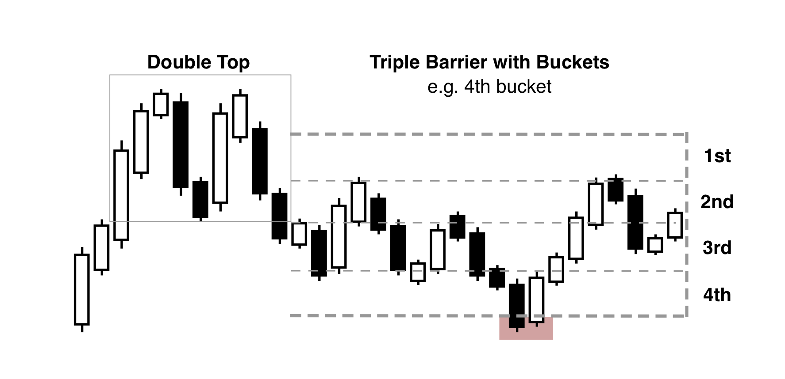

This thesis does not focus on trading strategies, where metrics such as risk-adjusted returns and maximum drawdowns would be of high interest. However, we need a method to gauge the impact of a specific event. Existing evaluation techniques used in trading strategies can be repurposed for our needs by treating each event like a trade. In this case, we limit the focus to understanding whether the events significantly differ from what would be expected by chance, without the need to consider extra factors like risk and fees, which are usually important in trading strategies.

Among the techniques used in trading strategy evaluations, the fixed-time horizon method (Figure \ref{fig:example_fixed_time_horizon}) is often used due to its simplicity. This method involves making a trade at a specific time and then evaluating its performance after a set period (e.g., one week). Despite its widespread use as a performance measure for trades, it is not ideal for evaluating trading models due to several reasons:

**1. Market volatility can distort statistical properties**

Market volatility can lead to significant price changes. Consequently, times of high volatility can lead to larger wins and losses. If the evaluation period overlaps with such volatile periods, it may distort the results.

**2. It does not reflect real-world trading conditions**

In real-world trading, stop-losses are used to limit losses for a trade. If the market suddenly drops but quickly recovers, the evaluation will not be affected, even though the trade might have resulted in a loss. This can result in underestimating losses.

**3. It does not provide information about trade direction**

This method calculates average returns over a set period but does not provide any information about the direction of a trade.

**4. It is limited in granularity as it requires checking multiple horizons**

To capture all possible scenarios, one needs to consider all horizons. If only a single horizon is used, key information could be overlooked.

The fixed-time horizon method, despite its simplicity and popularity, has limitations when it comes to evaluating trading models. As a result, we have chosen not to use this method in the analysis.

{#fig:example_fixed_time_horizon width=60%}

To address many of the issues prevalent in the fixed-time horizon method, we propose the implementation of the triple barrier method. This method incorporates three barriers: two horizontal (upper and lower) and one vertical (Figure \ref{fig:example_triple_barrier}). The horizontal barriers are set based on a specified threshold, functioning as stop-loss and take-profit limits. The vertical barrier is determined by a time interval. This enhancement over the fixed-time horizon method, which solely employs a time-based vertical barrier, introduces two supplementary horizontal barriers. These additional barriers offer increased insights into the trajectory of the event, thereby allowing us to classify the outcomes of patterns into one of three categories, based on the first barrier breached.

Employing the triple barrier method yields categorical or discrete labels, thereby providing a clearer distinction between random and pattern occurrences compared to percentage-based returns. While the analysis does not make use of the fixed-time horizon method, we recognise that it is essential for the findings to be comparable with other research using this method.

The triple barrier method addresses and resolves several challenges associated with the fixed-time horizon, as detailed below:

1. **Independence from Price Values:** Instead of relying solely on raw price values, the method uses the direction of the price change. This approach offers a less biased representation, as it does not get overly influenced by the magnitude of price changes, but rather focuses on their directional trend.

2. **Accounting for Market Crashes:** With the lower horizontal barrier in place, sudden market drops (which often lead to stop activations in traditional trading) are aptly accounted for. This barrier essentially acts as a safety net, capturing sharp negative price swings.

3. **Incorporation of Directionality:** Unlike the fixed-time horizon method, which mainly focuses on magnitude or average returns, the triple barrier method includes directionality. This feature informs whether the price escalated upwards or took a downward trajectory.

The addition of directionality is particularly crucial. It is not just about discerning whether an event has influenced the price; it is also about understanding *how* it influenced it. This is where the concept of directionality shines. Instead of merely calculating the net positive or negative returns, directionality dives deeper, providing a comprehensive perspective of price behaviors throughout the event's duration.

In unpredictable and volatile markets, prices can shift dramatically and swiftly. In such scenarios, directionality becomes even more paramount. By focusing solely on returns or price values, one might mistake these quick, intense price swings as mere market noise. But with the directionality feature of the triple barrier method, these fluctuations are interpreted in the context of the event, revealing whether they are genuine reactions to the event or just market anomalies.

In essence, integrating directionality does not just offer a binary view (impact or no impact). Instead, it provides a nuanced understanding, elucidating the specific direction of the influence, thereby deepening the comprehension of how events sway price movements.

One challenge that persists with the triple barrier method, similar to the fixed-time horizon method, is the need to evaluate across multiple time horizons. In real-world scenarios, holding a position indefinitely is unrealistic due to associated costs such as fees. However, by delivering data across multiple horizons, we can provide sufficient insights for those seeking to incorporate patterns into their existing trading strategies. To enable robust comparisons, we will also report the proportional differences and effect sizes in the findings.

{#fig:example_triple_barrier width=60%}

One aspect of the triple barrier method that we must account for is that the vertical barrier might be omitting some price dynamics. In order to evaluate the effect with timed-out trades, we will create a hybrid of the triple barrier method and a bucket-based classifier (Figure \ref{fig:example_buckets}).

{#fig:example_buckets width=60%}

One consideration while employing the triple barrier method is the potential omission of certain price dynamics due to the presence of the vertical barrier. To ensure an effective analysis of trades that reach the time-out phase, we introduce a hybrid approach that combines the triple barrier method and a bucket-based classifier (Figure \ref{fig:example_buckets}).

The bucket-based classifier, diverging from the other methods, does not rely on predetermined barriers or a fixed time interval. Instead, we divide outcomes based on a specified number of buckets, each representing a distinct range of outcomes. For instance, if we use a threshold of 5%, then a bucket would range from -5 to -2.5, -2.5 to 0, 0 to 2.5, and 2.5 to 5. This allocation system ensures that all trades find their place within a bucket.

The outcomes of the triple barrier method that strike the top or bottom barrier are allocated to the highest or lowest bucket, respectively. When an outcome hits the vertical barrier, we categorize the event into a bucket based on the nature of its exit. This approach allows us to capture the price dynamics potentially overlooked by the triple barrier method, while still leveraging the clear directionality it provides.

Using this hybrid bucket classifier helps circumvent the limitations of the fixed-time horizon method, while preserving the realistic assessment capabilities of the triple barrier method. We present the findings predominantly using the triple barrier method, given its comprehensive informational value. Outcomes from the bucket-based classifier will also be included for comparison, but will be discussed in detail only when they provide unique insights.

However, it is worth noting that while the bucket-based classifier enables a finer granularity of outcome classification, the benefits it offers over the triple barrier method are not as substantial as one might expect. As we will detail in future sections, the increased effort required to store and interpret the bucket-based data does not necessarily yield proportionally higher benefits. Therefore, for practical purposes, the triple barrier method still remains the primary evaluation technique.

With these two evaluation techniques - the triple barrier method and the hybrid bucket-based classifier - we are now well-equipped to label outcomes for both pattern and random events. These labels provide us with a concrete foundation to make a statistical comparison, thereby helping us understand if a pattern indeed has any substantial influence on future price movements.