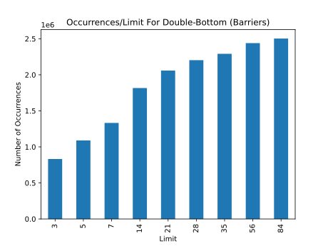
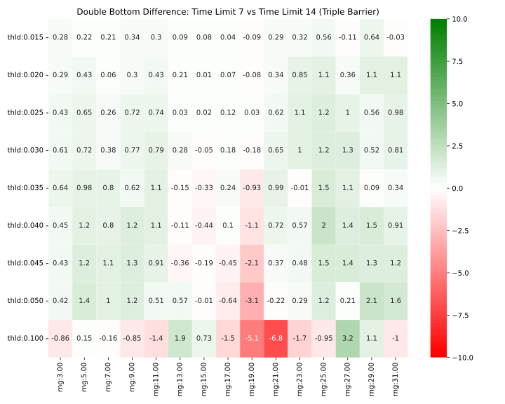
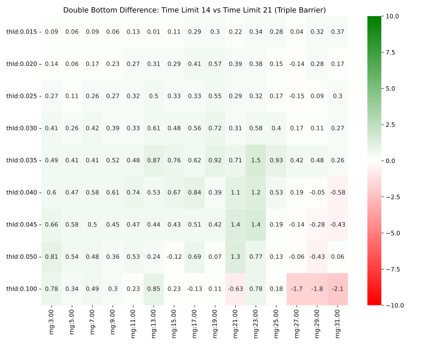
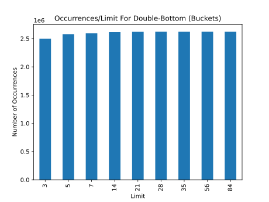

The timeout limit plays a vital role in adding a sense of realism to the trading simulations. In real-world scenarios, trades often cannot run indefinitely due to constraints such as margin calls and trading fees. Incorporating a timeout limit not only enhances the realism of the simulations, but it also enables us to extrapolate the average duration of a trade. This, in turn, informs us about the frequency at which a trade could be practically made given the observed win rate.

In addition to pursuing realism, the timeout limit plays an integral role in the reliability and the interpretability of the results generated by the Triple Barrier method. When trades are stopped due to reaching the timeout limit, they are excluded from the final results of the evaluation. If the timeout limit is set too low, a large number of trades may be stopped prematurely, resulting in a significant portion of the data being omitted from the final results. This omission could potentially skew the results and lead to misleading conclusions about the efficacy of trading patterns.

On the other hand, if the timeout limit is set too high, the trades may not reflect practical trading scenarios, thereby reducing the real-world applicability of the results. When the timeout limit is excessively high, nearly all trades reach completion, thereby diluting the differentiating power of the Triple Barrier method.

In this thesis, we carefully evaluated the impact of different timeout limits. To ensure a comprehensive analysis, we adopted a linear range of values as the timeout limit. The selection of these ranges was informed by the principle of balancing between an adequate sample size and the degree of realism the timeout limit imparts.

As the timeout limit decreases, trades are more likely to be prematurely terminated, leading to an increased rate of stopped trades. Conversely, as the timeout limit increases, trades have a higher chance of reaching completion, reducing the differential effect of varying the timeout limit.

To systematically understand the interplay between the timeout limit and the trade outcomes, we plotted the trade sample size as a function of time, condensing the various thresholds into a single continuum (see Figure \ref{fig:occurrences_timelimit_barriers}). This allowed us to observe the trends more comprehensively.

{#fig:occurrences_timelimit_barriers width=70%}

The resulting plot, specifically for the Triple Barrier method, exhibited a logarithmic relationship. This was anticipated as the number of patterns increased with the extension of the timeout limit. A critical observation was the substantial increment in the number of occurrences when transitioning from a 7-day to a 14-day timeout limit. Given that the 14-day limit accounted for more than half of the observed patterns, it was deemed a suitable choice for subsequent analyses.

A comparative evaluation of the 7-day and 14-day timeout limits indicated a marginal difference in the derived win rates (see Figure \ref{fig:timelimit_7_vs_14}). Furthermore, when examining the win rates between the 14-day and 21-day limits (refer to Figure \ref{fig:timelimit_14_vs_21}), the disparity was found to be even smaller. These observations provided further validation of the decision to adopt the 14-day limit, suggesting that it was a sufficiently representative for this thesis's objectives. Thus, the analysis highlights the critical role of the timeout limit in assessing trade performance and how the choice of limit can influence the interpretation of results.

{#fig:timelimit_7_vs_14 width=65%}

{#fig:timelimit_14_vs_21 width=65%}

In contrast to the Triple Barrier method, the bucket-based evaluator does not discard any trades; instead, it simply assigns them to their respective buckets regardless of whether they timed out. This results in a consistent number of trades across all timeout limits (see Figure \ref{fig:occurrences_timelimit_buckets}). While at first glance this might seem advantageous, it also poses a challenge in determining an appropriate timeout limit. This information is crucial when applying the Triple Barrier method in real-world scenarios, as it informs us about the practicable range for the timeout limit.

{#fig:occurrences_timelimit_buckets width=70%}

It is important to remember, however, that these observations are heavily dependent on the hyperparameters employed in the simulations. For instance, if the time granularity of the data were changed from daily to hourly candles, the suitable timeout limit would also likely decrease correspondingly. Therefore, while the findings provide some general guidance, the choice of timeout limit must be tailored to the specificities of each trading strategy and data set.

