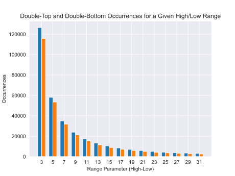

Before conducting the performance analysis of patterns, the discussion initially focuses on the parameter employed for detecting highs and lows. This parameter, termed as 'range', serves as the sliding window for identifying local minima and maxima. Through testing, it becomes evident that this range parameter significantly impacts the types of patterns detected. No single value manifests as universally optimal for the detection of all patterns. Therefore, to understand the variety and number of patterns, an iteration over a set of values is performed to ascertain the patterns detected for each range parameter.

{#fig:pattern_occurences width=70%}

Figure \ref{fig:pattern_occurences} presents an exponential decline in pattern detection as the step size (or range value) increases. The chart spans a range from step size 3 to step size 31.

At the onset, with a step size of 3, there's a peak in pattern detection with around 120k samples. Yet, as we progress, each increment in the step size by 2 leads to a substantial drop in detected patterns: 60k at a step size of 5, 37k at a step size of 7, and so forth.

To elucidate this trend, let's delve into the mechanics:

1. **Persistence of Minima and Maxima**: "Minima" and "maxima" denote the lowest and highest points within a specific data window. As the size of this window (the range) adjusts, these low and high points can remain consistent. In other words, when varying the range, the same patterns formed by these points may be identified in multiple range configurations.

2. **Recurring Patterns**: Given the persistence of certain minima and maxima across range adjustments, some patterns may reappear across different step sizes. These patterns are not confined to a specific range; they can manifest across a spectrum of configurations.

3. **Impact of Broader Ranges**: While the recurrence of some patterns can be observed, an expansive range may miss out on detecting more intricate or short-term patterns. These patterns, clearer within a confined window, might become less pronounced or altogether omitted in a wider scope. This omission becomes more prevalent as the step size increases, contributing to the exponential drop in detected patterns.

In essence, as the window broadens (with larger step sizes), while some patterns persist, others get overshadowed or missed, leading to the overall decline in pattern occurrences as depicted in Figure \ref{fig:pattern_occurences}.

Informed by these findings, the selected parameters for the final evaluation are set at 3, 5, 7, 9, 11, 13, and 15. The forthcoming analysis and tables are based on these range parameters. It is also noted that although larger range values can expand the detection scope, they simultaneously risk diminishing the predictive power. The process of identifying highs and lows inherently serves as a lagging indicator, thereby introducing a lag equivalent to $range/2$. Consequently, an extensive sliding window might render a pattern obsolete by the time it is detected, a phenomenon that is accentuated in the subsequent results.

Given these considerations, the range is capped at 15, and the results for each range are consolidated in the result table. The final values are discussed in the context of the time limit and threshold range for the triple barrier method.

The discussion then transitions to the examination of the heatmaps and results generated from the detected patterns.