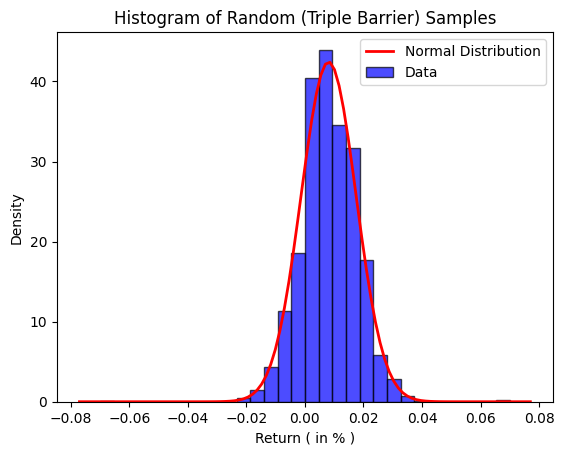

Before delving into the analysis of the results, it is imperative to confirm the randomness of the dataset. An initial observation revealed a concerning skew in profitability, even in what was termed as "random data." This unexpected profitability raised questions about the genuine randomness of the data. Therefore, the primary objective is to validate the true randomness of this dataset to ensure the credibility of all subsequent analyses.

**Examining Average Returns**

To confirm the randomness of the dataset, we examined the average return for each candle, which is computed as:
$$ \text{Average Return} = \frac{Close - Open}{Open} $$

From the calculations, the average of all returns indicated a profit of 0.03528% per candle. Ideally, in a completely random setting, this figure should be zero. However, given that the dataset includes stocks with historically strong performances in the S&P 500, a slight deviation can be understood.

**Utilizing Validator Scripts and Strategies**

We further substantiated the findings with an auxiliary validator script. This script makes use of outputs from the Triple Barrier and bucket-based methods. The focus here was not on the typical performance metrics of the Triple Barrier method. Instead, we concentrated on the return per run to determine the percentage return within the Triple Barrier method context. From these strategies, we deduced an average return of 0.81% (sd=0.94%), a value significantly higher than the single candle return.

For clarity, these strategies pertain to the Triple Barrier method's performance metrics, where we assess the impact of various events on the stock price.

**Contextualizing the Data with Timeframes and Samples**

To provide further context, the analysis revealed that the average trade lasted about 29 days. With this information, we deduced an annual return of \(mean=10.185, sd=11.825, n=8530\).

Here, the 8530 samples are a culmination of various symbols and trials. To elucidate:

- Symbols refer to the different stock entities in the dataset.
- Trials pertain to 15 individual runs for each stock symbol, each representing a distinct, randomly generated set of stock market events.

The Triple Barrier method then evaluates the performance of these event sets, resulting in what we term a "collective sample." These samples are assessed by using a 7% barrier threshold and a generous time limit of 500 days.

**Estimating Annual Returns**

By projecting the single candle return (0.035%) over an entire year (365 days), we estimate an annual return of approximately 12.8772%. It is important to recognize that this projection could be on the higher side, as the chosen stocks represent historically high-performing companies.

**Comparative Analysis with S&P 500**

For a well-rounded understanding, we compared the findings with the S&P 500's historical average return over 30 years. The S&P 500 displayed a return of 9.78% with a standard deviation of 14.96. These figures were deduced by analyzing the SPY index from May 1992 to May 2023. Although some platforms might display slightly varied results, the differences are not statistically significant[@sp500_backtest].

To gauge the significance of these numbers, we conducted a two-sample t-test. Before this, we ensured that the returns from the random trades followed a normal distribution, as shown in Figure \ref{fig:validate_random}. The test comprised two samples: the annual return from the random trades and the S&P 500's historical annual return.

{#fig:validate_random width=70%}

**Conclusion: Skewness Originating from S&P 500's Rise**

The t-statistic calculated was 0.1871 with a corresponding p-value of 0.8516. This suggests no statistically significant difference between the random trades' performance and the S&P 500's historical returns. Given that the dataset originates from companies once part of the S&P 500 and still operating, this result is consistent with the expectations.

In conclusion, the skewness observed in the random data likely stems from the inherent upward trajectory of the S&P 500. It is vital to consider this factor when assessing the efficacy of different trading patterns.