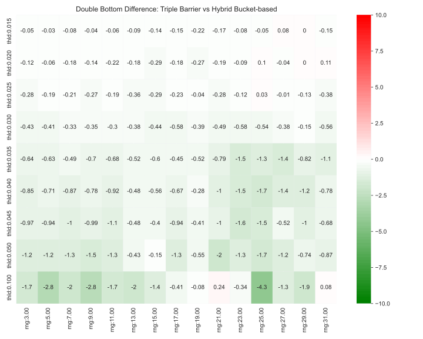
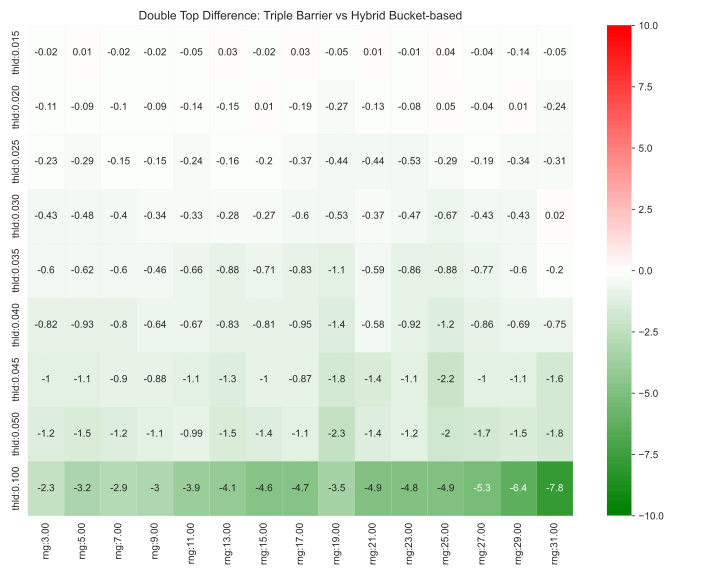

We perform an in-depth comparative analysis of two distinct approaches for assessing trading pattern outcomes: the Triple Barrier Method and the Hybrid Bucket-based Classifier. Both techniques provide valuable insights into trading patterns, differing fundamentally in how they capture and interpret pattern behaviour.

Initially, we employed the Triple Barrier Method for its straightforwardness and its ability to label results clearly. However, this method has its limitations. A key concern is its propensity to disregard or 'time out' certain outcomes. This tendency could potentially lead to biases in the findings, as it might exclude substantial losses, leaving them unaccounted for in the analysis. Such discrepancies could significantly skew the understanding of a pattern's performance.

To address these limitations and provide a more comprehensive portrayal of trading pattern outcomes, we introduced the Hybrid Bucket-based Classifier. This approach enables us to more precisely capture price movements, including those that might not fully play out within the evaluation timeframe. The bucket-based method offers a more detailed picture of pattern performance and crucially circumvents the data omission problem intrinsic to the Triple Barrier Method.

In the comparison, we observed intriguing subtleties in the representation of win rates for certain patterns. Specifically, when examining the double bottom pattern, it became clear that we tended to underestimate the pattern in nearly all cells (see Figure \ref{fig:buckets_vs_barriers}). This underestimation by the Triple Barrier Method aligns with the understanding of market biases, in which the market naturally tends to ascend over time. By leaving out incomplete movements, the Triple Barrier Method unintentionally makes the evaluation process more rigorous, tilting the results towards a lower estimation of win rates.

{#fig:buckets_vs_barriers width=65%}

However, this underestimation does not necessarily imply an unreliable evaluator. On the contrary, it suggests a more conservative and stringent evaluation that might bolster the confidence in the outcomes. Notably, a conservative estimate does not always offer an advantage. For instance, in patterns like double bottom, where higher win rates are expected, this tendency might erroneously seem to favor the pattern, particularly at larger thresholds (see Figure \ref{fig:buckets_vs_barriers_neg}). But, as evident in the figure, this issue only arises when the threshold increases significantly, which is expected as it would require more market volatility. So, while small thresholds are less prone to this concern, we need to maintain caution when interpreting such results, keeping in mind this inherent tendency.

{#fig:buckets_vs_barriers_neg width=65%}

The comparison extends to cases where negative outcomes are expected, with similar conclusions. The differences in outcome representation become more conspicuous as the evaluation threshold increases, a logical conclusion since higher thresholds necessitate greater market volatility for trade closure.

In summary, while both methods possess distinct strengths and weaknesses, they contribute collectively to a comprehensive understanding of pattern performance. Acknowledging these subtleties allows for a more accurate interpretation of the results, providing a robust basis for trading decisions rooted in pattern recognition. We will consider these nuances when analyzing results for patterns like double bottom, triple bottom, and head and shoulders.

