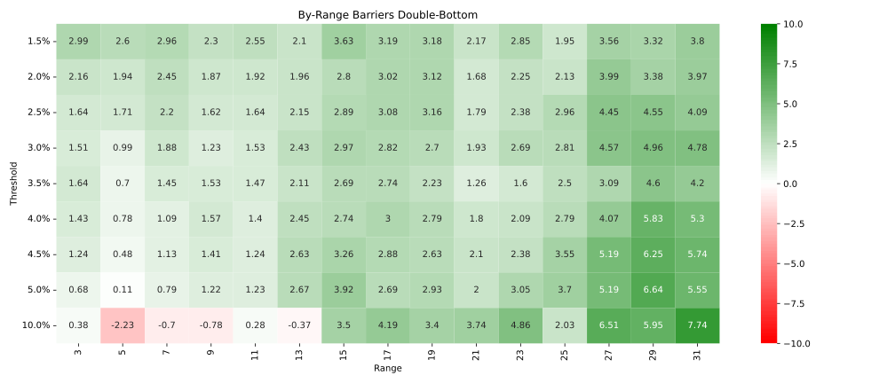
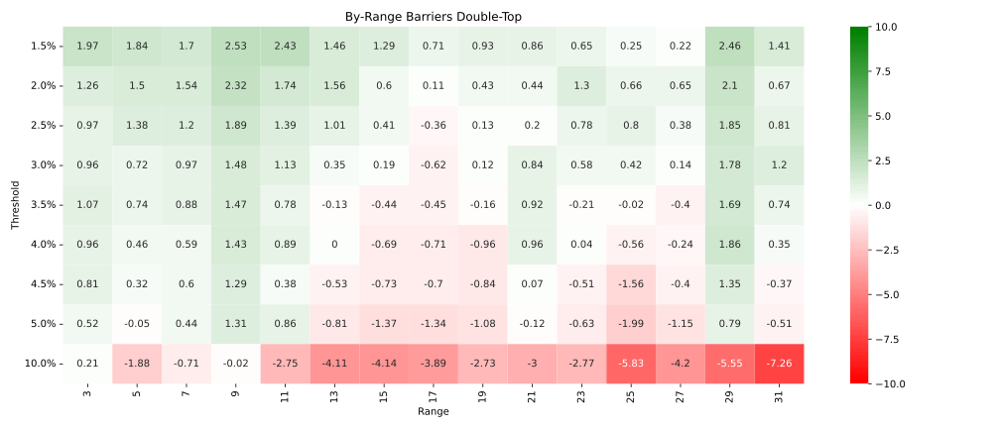
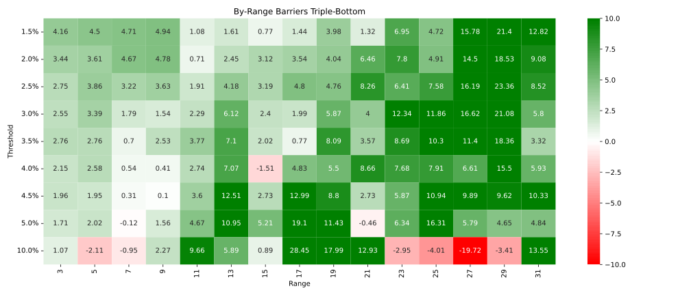
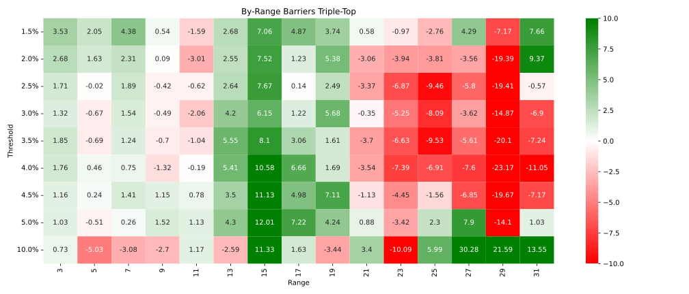
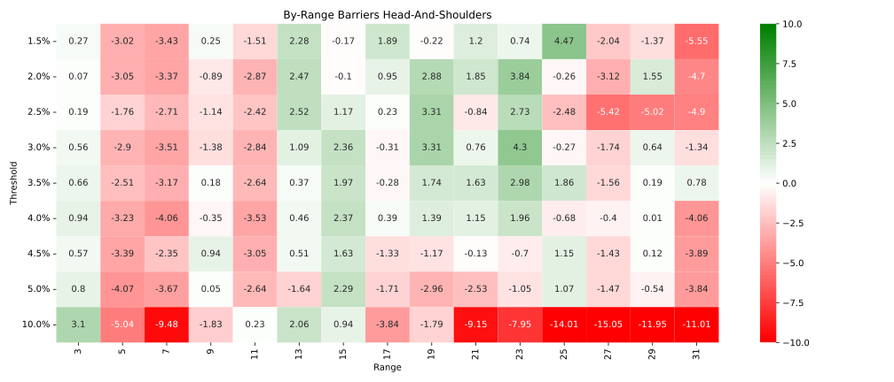

In this section, we provide a detailed interpretation of the results derived from each of the pattern algorithms: random, double bottom, double top, triple Bottom, triple Top, and head and shoulders. Each algorithm's performance is assessed within the context of the Triple Barrier Method and the Hybrid Bucket-based Classifier, as discussed in the previous sections.

**Random**

Starting with random, we observe that the win rate increases proportionately with the threshold (see Figure \ref{fig:barrier_random_wr}), which holds across all ranges. This is expected as the range parameter does not influence the generation of random results.

{#fig:barrier_random_wr width=90%}

**Double Bottom**

Moving on to the double bottom pattern, the results align with the literature expectations. The pattern displays a high win rate across almost all cases and outperforms the random baseline (see Figure \ref{fig:barrier_double_bottom_diff}). However, while a statistical analysis confirms this difference as significant (see Figure \ref{fig:barrier_double_bottom_p}), it also reveals a relatively small effect size (see Figure \ref{fig:barrier_double_bottom_h}). This suggests that although the double bottom pattern does demonstrate an advantage, the effect is not substantial enough to validate it as a standalone trading strategy.

{#fig:barrier_double_bottom_diff width=90%}

**Double Top**

The double top pattern, on the other hand, deviates from literature expectations. Contrary to the predicted sub-50% win rates, the results show win rates exceeding 50% in most cases. We observe statistical significance only up to a 4% threshold, with an effect size similar to the double bottom pattern. Thus, while the double top pattern may be effective in isolated instances, the overall results suggest its performance is inconsistent and should be considered with caution (see Figure \ref{fig:barrier_double_top_diff}).

{#fig:barrier_double_top_diff width=90%}

**Triple Bottom**

With the triple bottom pattern, the results exhibit a marked amplification from the double bottom signal. However, the sample size is considerably smaller (see Figure \ref{fig:barrier_triple_bottom_samples}), and the win rate appears quite chaotic across thresholds and ranges (see Figure \ref{fig:barrier_triple_bottom_wr}). After correction, we find that only up to a barrier threshold of 2.5% the results are significantly different from random, suggesting that the pattern may not be as effective as the literature suggests (see Figure \ref{fig:barrier_triple_bottom_diff}).

{#fig:barrier_triple_bottom_diff width=90%}

**Triple Top**

The Triple Top pattern yields significant results only barrier thresholds of 1.5% and 2.5%, suggesting inconsistent and unreliable performance (see Figure \ref{fig:barrier_triple_top_diff}). This diverges from the expected pattern behavior in literature, further questioning its reliability as a trading strategy.

{#fig:barrier_triple_top_diff width=90%}

**Head and Shoulders**

Despite its prevalence in the literature, the head and shoulders pattern yields fewer samples than anticipated, with performance appearing no different from random (see Figure \ref{fig:barrier_head_and_shoulders_diff}). This may result from the focus on daily ranges or a need for wider ranges. Still, these results suggest that the conventional wisdom around this pattern may not hold in the practical trading context.

{#fig:barrier_head_and_shoulders_diff width=90%}

In summary, the findings underscore the importance of critically evaluating pattern performance in the context of real-world data. While some patterns align with theoretical expectations, others diverge significantly, highlighting the need for a nuanced and data-driven approach in pattern-based trading strategies.