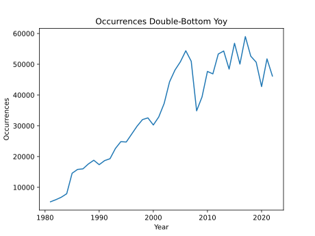

In the concluding segment of the results and discussions, we delve into the temporal aspects of the pattern analysis. Given the span of data collected over numerous years, we've aggregated the results on an annual basis to discern any emergent temporal patterns.

**Performance**

To investigate temporal trends in pattern detection on a year-over-year basis, we aggregated the outcome metrics for each pattern annually. This methodology counteracts the non-uniform distribution of the dataset by focusing on the win rates for each year rather than raw pattern counts. We conducted a regression analysis on these win rates.

Using the double bottom pattern as an example, there's a noticeable yet slight decline in its win rate (see Figure \ref{fig:yoy_double_bottom}). With an annual decrease of 0.08 percent (Slope: -0.0008, P-value: 0.1144, Standard error: 0.0005), this trend is not statistically significant.

{#fig:yoy_double_bottom width=70%}

A similar trend, or lack thereof, was found for the double top pattern (see Figure \ref{fig:yoy_double_top}). A near-zero slope (Slope: -0.0000, P-value: 0.9618, Standard error: 0.0006) indicates no noticeable trend over the years. This observation aligns with previous findings where the double bottom pattern showed significance only for smaller thresholds.

{#fig:yoy_double_top width=70%}

This lack of significance was consistent in the analysis of all other patterns, underscoring the recurring theme of non-significant trends.

**Occurrences**

When examining occurrences, the aim was to present a normalized view of the double bottom pattern. An analysis of the double bottom occurrences shows a consistent increase year-over-year. This is in line with the expectations given the growing sample size as time progresses (see Figure \ref{fig:yoy_occ_double_bottom}).

{#fig:yoy_occ_double_bottom width=70%}

To gain a clearer understanding of pattern growth, we first calculated the relative frequencies of the random pattern. Since the occurrences of the random pattern are determined by a fixed probability, its counts can hint at data density during particular time frames (see Figure \ref{fig:yoy_freq_random}). By comparing these frequencies with the double bottom's occurrences and then normalizing the adjusted samples, we get a clearer picture of how pattern detections have evolved over time.

{#fig:yoy_freq_random width=70%}

The resulting chart suggests an upward movement. However, due to its volatility, it is challenging to pinpoint a definite trend. One possibility is that earlier data was heavily influenced by a select group of high-performing stocks. Another potential reason could be an increase in market volatility over time. Drawing firm conclusions, however, would require further investigation.

{#fig:yoy_trend_double_bottom width=70%}

While patterns such as the double bottom revealed noticeable trends, statistical significance was not uniformly present across all patterns. Furthermore, even when significance was observed, it is likely influenced by factors beyond merely an increase in the number of patterns. Drawing direct conclusions remains challenging, underscoring that understanding the intricacies of financial markets is a nuanced task, necessitating ongoing research and examination.

\newpage
