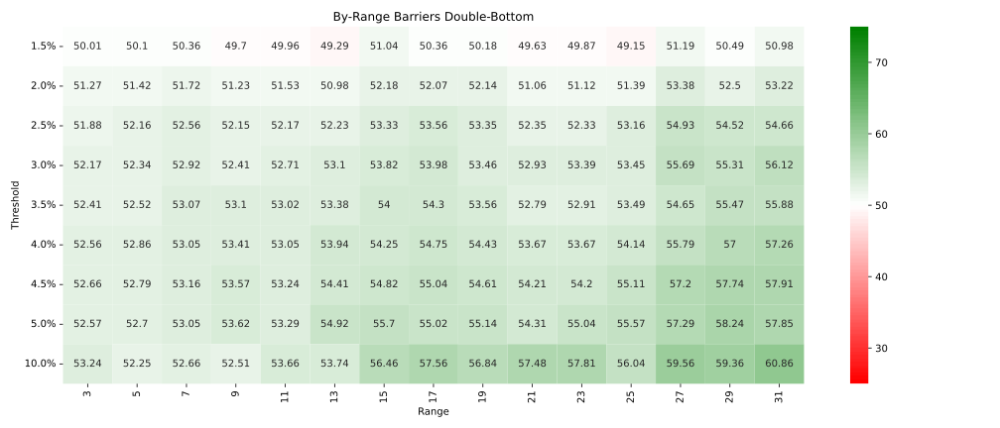

\newpage
\appendix

# Appendix

<!-- Random -->

{#fig:barrier_random_samples width=90% .float-placement}

<!-- Double Bottom -->

{#fig:barrier_double_bottom_wr width=90% .float-placement}

{#fig:barrier_double_bottom_samples width=90% .float-placement}

{#fig:barrier_double_bottom_p width=90% .float-placement}

{#fig:barrier_double_bottom_h width=90% .float-placement}

<!-- Double Top -->

{#fig:barrier_double_top_wr width=90% .float-placement}

{#fig:barrier_double_top_samples width=90% .float-placement}

{#fig:barrier_double_top_p width=90% .float-placement}

{#fig:barrier_double_top_h width=90% .float-placement}

<!-- Triple Bottom -->

{#fig:barrier_triple_bottom_wr width=90% .float-placement}

{#fig:barrier_triple_bottom_samples width=90% .float-placement}

{#fig:barrier_triple_bottom_p width=90% .float-placement}

{#fig:barrier_triple_bottom_h width=90% .float-placement}

<!-- Triple Top -->

{#fig:barrier_triple_top_wr width=90% .float-placement}

{#fig:barrier_triple_top_samples width=90% .float-placement}

{#fig:barrier_triple_top_p width=90% .float-placement}

{#fig:barrier_triple_top_h width=90% .float-placement}

<!-- Head And Shoulders -->

{#fig:barrier_head_and_shoulders_wr width=90% .float-placement}

{#fig:barrier_head_and_shoulders_samples width=90% .float-placement}

{#fig:barrier_head_and_shoulders_p width=90% .float-placement}

{#fig:barrier_head_and_shoulders_h width=90% .float-placement}

\clearpage

## Dataset Information

**Last retrieval data**

April 23, 2023

**List of Symbols**

A, AAPL, ABB, ABC, ABEV, ABMD, ABT, ACGL, ACIW, ACN, ADI, ADP, AEE, AEG, AEM, AEP, AES, AFG, AFL, AGCO, AGR, AIG, AIN, AIT, AJG, AJRD, ALGN, ALK, ALKS, ALL, ALV, AMAT, AMD, AME, AMG, AMGN, AMKR, AMOV, AMT, AN, ANSS, AON, AOS, APA, APD, APH, ARE, ARW, ASH, ASML, ATI, ATVI, AU, AVA, AVT, AVY, AZN, AZO, BA, BAC, BALL, BAM, BAP, BB, BBD, BBVA, BBWI, BBY, BC, BCE, BCS, BEN, BG, BHC, BIIB, BIO, BK, BKNG, BLK, BMO, BMRN, BMY, BOH, BP, BPOP, BRC, BRFS, BRKR, BRO, BSAC, BWA, BXP, BYD, CAG, CAH, CAJ, CAR, CASY, CB, CBRL, CBSH, CBT, CCEP, CCI, CCJ, CCL, CDNS, CEA, CHD, CHE, CHKP, CHRW, CI, CIB, CIEN, CINF, CL, CLF, CMA, CMC, CMI, CMS, CNA, CNC, CNI, CNP, CNQ, COF, COKE, COO, COP, COST, CPB, CPRT, CR, CRH, CRUS, CS, CSCO, CSGP, CSGS, CSL, CTAS, CTRA, CTSH, CUK, CVS, CZR, D, DB, DCI, DD, DDS, DHI, DHR, DIS, DISH, DLTR, DOV, DRI, DTE, DUK, DVA, DVN, DXC, E, EBAY, ECL, ED, EHC, EL, ELP, ELV, EMN, ENB, EOG, EPD, EQNR, EQR, ERIC, ERIE, ES, ESS, ETR, EVRG, EW, EXC, EXPO, F, FAST, FE, FFIV, FHN, FIS, FISV, FITB, FL, FLR, FLS, FMC, FMS, FRHC, FSS, FUL, GD, GE, GEF, GFI, GGB, GGG, GHC, GIB, GILD, GIS, GL, GLW, GOLD, GPC, GPN, GPS, GRMN, GS, GSK, GT, GWW, HAL, HAS, HBAN, HD, HDB, HE, HEI, HES, HIG, HL, HMC, HOG, HON, HP, HPQ, HRB, HRL, HSBC, HSIC, HST, HSY, HUBB, HUM, HXL, IBM, IBN, IDA, IFF, ILMN, INCY, INFY, ING, INTC, INTU, IP, IPG, ISRG, IT, ITUB, ITW, IVZ, J, JBHT, JBL, JBLU, JCI, JEF, JOE, JPM, JWN, K, KAI, KBH, KEP, KEY, KGC, KLAC, KLIC, KMB, KMPR, KMT, KO, KOF, KR, KSS, KT, L, LAMR, LANC, LEG, LEN, LH, LIN, LLY, LMT, LNC, LNT, LUMN, LUV, M, MAR, MAS, MAT, MCD, MCHP, MCK, MCO, MDU, MEOH, MET, MFC, MGA, MGM, MKC, MKL, MLM, MMC, MMM, MNST, MO, MOS, MRO, MS, MSA, MSI, MSTR, MT, MTB, MTD, MTG, MTZ, MU, MUFG, MUR, NCR, NEE, NEM, NEU, NFG, NI, NKE, NLOK, NLY, NOK, NOV, NSC, NTAP, NTES, NUE, NUS, NVDA, NVO, NVR, NVS, NWL, NYT, O, ODFL, OGE, OI, OKE, OLN, OMC, ON, ORCL, ORI, ORLY, OSK, OVV, OXY, PAA, PARA, PBR, PCAR, PCG, PCH, PDCO, PEAK, PEG, PEP, PFE, PG, PGR, PH, PHG, PHI, PHM, PKI, PLD, PLUG, PLXS, PNR, PNW, PPC, PPG, PPL, PRGO, PRU, PSA, PTR, PVH, QCOM, QGEN, R, RCI, RCL, RDN, REGN, RF, RGEN, RHI, RIG, RL, RMBS, RMD, ROG, ROL, ROP, ROST, RPM, RRC, RY, SAN, SANM, SAP, SBAC, SCCO, SCI, SEB, SEE, SEIC, SGEN, SHI, SHW, SID, SIG, SIGI, SIRI, SIVB, SJM, SJR, SKM, SKY, SLAB, SLB, SLF, SLM, SMG, SNA, SNN, SNPS, SNV, SO, SON, SONY, SPG, SPGI, SQM, SRE, SSL, STE, STM, STT, STZ, SWK, SWKS, SWN, SXT, SYK, SYY, T, TD, TEF, TEO, TEVA, TFC, TGNA, TGT, THC, TIMB, TKC, TKR, TLK, TM, TMO, TOL, TPL, TPR, TR, TRMB, TRN, TROW, TRP, TRQ, TRV, TSM, TT, TTC, TTE, TTEC, TTWO, TV, TXN, TXT, TYL, UGP, UHS, UL, UMBF, UMC, UNF, UNH, UNM, UNP, UPS, URI, USB, VALE, VFC, VIAV, VICR, VIV, VLO, VLY, VMC, VMI, VNO, VOD, VRSN, VTR, VTRS, VZ, WAFD, WAT, WBA, WEC, WELL, WERN, WHR, WIT, WM, WMB, WMK, WMT, WOLF, WOR, WPP, WRB, WSM, WST, WTM, WTS, WTW, WY, XEL, XOM, XRAY, Y, YPF, YUM, ZBH, ZBRA, ZION, ZNH
